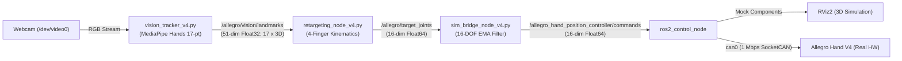

# Allegro Hand Vision Retargeting & Teleoperation (V6 5-Finger & V4 4-Finger)

RGB 비전 카메라(Intel RealSense 또는 일반 웹캠)와 MediaPipe Hands를 이용한 Wonik Robotics **Allegro Hand V6 (5손가락, 20-DOF)** 및 **Allegro Hand V4 (4손가락, 16-DOF)** 실시간 비전 리타기팅 및 원격 제어(Teleoperation) ROS 2 패키지입니다.

최신 업데이트를 통해 **Intel RealSense D455 RGB 카메라 자동 연동**, **60Hz / 100Hz 고주파 보간 제어 루프(모터 떨림 및 지터링 완전 억제)**, **카메라 GUI 2배 확대 및 리사이징**, **RVIZ 5지 직립 시각화(+Z 방향)**가 지원됩니다.

---

## 📌 Architecture & Dataflow

### 1. Allegro Hand V6 (5-Finger, 20-DOF) Pipeline

```mermaid
flowchart LR
    A["Intel RealSense RGB (/dev/video8)<br/>또는 Webcam (/dev/video0)"] -->|"RGB Stream (60 FPS)"| B["vision_tracker_v6.py<br/>(MediaPipe Hands 21-pt)"]
    B -->|"/allegro/vision/landmarks<br/>(63-dim Float32: 21 x 3D)"| C["retargeting_node_v6.py<br/>(5-Finger Kinematics)"]
    C -->|"/allegro/target_joints<br/>(20-dim Float64)"| D["sim_bridge_node_v6.py<br/>(60Hz/100Hz Timer + EMA Filter)"]
    D -->|"/allegro_hand_position_controller/commands<br/>(20-dim Float64 @ 60Hz/100Hz)"| E["ros2_control_node<br/>(update_rate: 100Hz)"]
    E -->|"Mock Components"| F["RViz2 (3D Simulation)"]
    E -->|"AllegroHandV6System<br/>(Modbus TCP: 192.168.1.100:502)"| G["Allegro Hand V6 (Real HW)"]
```


### 2. Allegro Hand V4 (4-Finger, 16-DOF) Pipeline


---

## 💻 설치 환경 및 사전 요구 사항 (Environment & Prerequisites)

### 1. 시스템 및 도커(Docker) 환경

본 시스템은 **Docker 컨테이너(`ros_humble_dev`)** 기반으로 구축 및 실행됩니다.

- **호스트 운영체제**: Linux (Ubuntu 22.04 LTS 권장)
- **도커 베이스 이미지**: `osrf/ros:humble-desktop` (Ubuntu 22.04 + ROS 2 Humble)
- **도커 컨테이너 생성 및 실행 명령어**:
  ```bash
  # 호스트 터미널에서 X11 GUI 접근 허용
  xhost +local:docker

  # ros_humble_dev 컨테이너 생성 및 백그라운드 실행
  docker run -it -d \
    --name ros_humble_dev \
    --privileged \
    --net=host \
    -e DISPLAY=$DISPLAY \
    -v /tmp/.X11-unix:/tmp/.X11-unix:rw \
    -v /home/jake/humble_ws:/home/humble_ws:rw \
    osrf/ros:humble-desktop
  ```
  > **주의**: USB 카메라 노드 생성(`/dev/video*`), SocketCAN(`can0`), 고성능 네트워크 제어를 위해 `--privileged` 및 `--net=host` 옵션이 필수적입니다.

### 2. 시스템 패키지 (Ubuntu / ROS 2 Humble)

컨테이너 내부에서 필요한 핵심 ROS 2 및 하드웨어 도구 패키지:

```bash
apt-get update && apt-get install -y \
  ros-humble-ros2-control \
  ros-humble-ros2-controllers \
  ros-humble-joint-state-broadcaster \
  ros-humble-position-controllers \
  ros-humble-rmw-cyclonedds-cpp \
  ros-humble-tf2-ros \
  ros-humble-rviz2 \
  v4l-utils \
  can-utils \
  python3-pip
```

### 3. Python 의존성 (Python 3.10)

`allegro_vision_teleop/requirements.txt`에 명시된 필수 라이브러리:

```bash
pip3 install -r /home/humble_ws/allegro_vision_teleop/requirements.txt
```

| 패키지 | 권장 버전 | 설명 |
|---|---|---|
| `mediapipe` | `==0.10.14` | 구글 실시간 손 랜드마크 3D 추론 프레임워크 |
| `opencv-python` | `>=4.8.0, <4.11` | V4L2 카메라 캡처 및 고해상도 디버그 GUI |
| `opencv-contrib-python` | `>=4.8.0, <4.11` | 추가 비전 프로세싱 도구 |
| `numpy` | `>=1.21.0, <2.0.0` | 3D 관절 기구학 벡터 계산 및 EMA 필터링 |
| `scipy` | `<1.14.0` | 수학적 행렬 연산 및 필터링 |

### 4. 하드웨어 및 네트워크 설정

#### A. Allegro Hand V6 (5-Finger, Modbus TCP)
1. **전원**: 24V DC 산업용 파워서플라이 연결 후 스위치 ON.
2. **이더넷 통신**: PC 유선 랜포트와 로봇 핸드 랜포트를 직접 연결.
3. **PC 랜카드 고정 IP 설정**:
   - **IP 주소**: `192.168.1.10`
   - **서브넷 마스크**: `255.255.255.0` (`/24`)
   - **게이트웨이**: `192.168.1.1` (생략 가능)
   - **로봇 핸드 기본 IP**: `192.168.1.100` (Modbus TCP 포트: `502`)
4. **연결 상태 확인**:
   ```bash
   ping -c 1 192.168.1.100
   nc -zv 192.168.1.100 502
   ```

#### B. 카메라 (Intel RealSense D455 / D435 / 웹캠)
- USB 3.0 포트에 RealSense 카메라를 연결합니다.
- RealSense 연결 시 커널에서 생성되는 비디오 노드:
  - `/dev/video4`: Depth 스트림
  - `/dev/video6`: IR 적외선 스트림 (레이저 프로젝터 도트 패턴)
  - **`/dev/video8`**: **True Color RGB 스트림 (640x480 @ 60fps)**
- `run_v6.sh` 실행 시 시스템이 RealSense RGB 스트림(`/dev/video8`)을 **자동 감지하여 기본 카메라로 연동**합니다. RealSense가 없으면 노트북 웹캠(`/dev/video0`)으로 자동 폴백됩니다.

#### C. Allegro Hand V4 (4-Finger, SocketCAN)
- PEAK-System PCAN-USB 또는 지원 CAN 어댑터 연결.
- 호스트 터미널에서 `can0` 인터페이스를 1 Mbps로 활성화:
  ```bash
  sudo ip link set can0 down && sudo ip link set can0 type can bitrate 1000000 && sudo ip link set can0 up
  ```

---

## 🛠️ 빌드 방법 (Build Instructions)

컨테이너 내부(`/home/humble_ws`)에서 ROS 2 워크스페이스 빌드:

```bash
docker exec -it ros_humble_dev bash -c "
  source /opt/ros/humble/setup.bash && \
  cd /home/humble_ws && \
  colcon build --symlink-install
"
```

실행 편의를 위해 단축 심볼릭 링크가 `/usr/local/bin`에 등록되어 있습니다:
- `run_v6` -> `/home/humble_ws/allegro_vision_teleop/run_teleop_v6.sh`
- `run_v4` -> `/home/humble_ws/allegro_vision_teleop/run_teleop_v4.sh`

---

## 📂 Repository Structure

```text
allegro_vision_teleop/
├── README.md                 # 프로젝트 개요 및 종합 매뉴얼
├── requirements.txt          # Python 필수 라이브러리 목록
├── run_teleop.sh             # 통합 실행 스크립트
│
├── [V6 5-Finger 20-DOF]
│   ├── run_v6.sh             # V6 전용 올인원 실행 스크립트 (run_teleop_v6.sh 심볼릭 링크)
│   ├── run_teleop_v6.sh      # V6 하드웨어/시뮬레이션 및 3개 텔레옵 노드 통합 제어
│   ├── vision_tracker_v6.py  # 21개 3D 랜드마크 추출 노드 (RealSense 자동 감지, 60 FPS, 화면 배율 지원)
│   ├── retargeting_node_v6.py# 5지 20관절 기구학 벡터 매핑 노드
│   ├── sim_bridge_node_v6.py # 고주파(60Hz/100Hz) 타이머 보간 제어 + 20관절 EMA 필터 노드
│   └── safety_utils_v6.py    # V6 관절 순서(joint00~43), URDF 한계값 및 안전 리미터
│
└── [V4 4-Finger 16-DOF]
    ├── run_v4.sh             # V4 전용 실행 스크립트 (run_teleop_v4.sh 심볼릭 링크)
    ├── run_teleop_v4.sh      # V4 하드웨어/시뮬레이션 통합 런처
    ├── vision_tracker_v4.py  # 17개 3D 랜드마크 추출 노드
    ├── retargeting_node_v4.py# 4지 16관절 기구학 리타기팅 노드
    ├── sim_bridge_node_v4.py # 16관절 EMA 필터 브릿지 노드
    └── safety_utils_v4.py    # V4 관절 매핑(ah_joint00~33) 및 안전 유틸
```

---

## 🚀 실행 가이드 (Quick Start)

### 1. Allegro Hand V6 (5-Finger) 실행

#### ① 실물 하드웨어 제어 (Real Hardware Control - 추천)
로봇 24V 전원 및 이더넷 연결 확인 후 아래 명령어를 실행합니다:

```bash
docker exec -it -e DISPLAY=$DISPLAY ros_humble_dev run_v6 real --rate 60 --scale 2.0 --alpha 0.18
```

- **`--rate 60`**: 로봇에게 명령어를 정확히 60Hz(또는 `--rate 100`으로 100Hz)로 연속 송출하여 **모터 떨림(지터링)을 완벽하게 억제**합니다.
- **`--scale 2.0`**: 영상 녹화 및 모니터링에 적합하도록 카메라 GUI 창을 2배 크기(1280x960)로 띄웁니다 (마우스로 창 크기 자유 조절 가능).
- **`--alpha 0.18`**: 지수 이동 평균(EMA) 필터를 적용하여 손의 떨림을 거르고 자연스러운 움직임을 만듭니다.

#### ② 가상 시뮬레이션 (RViz2 Simulation)
실제 로봇 핸드 없이도 RVIZ 가상 로봇 손으로 비전 추종을 테스트할 수 있습니다:
```bash
docker exec -it -e DISPLAY=$DISPLAY ros_humble_dev run_v6 sim --scale 1.75
```

#### ③ 비전 텔레옵 노드만 실행 (Nodes Only)
외부 ROS 2 제어기나 별도 환경에서 런치된 핸드와 연동할 때 사용합니다:
```bash
docker exec -it -e DISPLAY=$DISPLAY ros_humble_dev run_v6 nodes
```

---

### 2. Allegro Hand V4 (4-Finger) 실행

#### ① 실물 하드웨어 제어 (SocketCAN)
```bash
docker exec -it -e DISPLAY=$DISPLAY ros_humble_dev run_v4 real --alpha 0.20
```

#### ② 가상 시뮬레이션 (RViz2)
```bash
docker exec -it -e DISPLAY=$DISPLAY ros_humble_dev run_v4 sim
```

---

## ⚙️ 커맨드라인 옵션 상세 (CLI Options)

| 옵션 | 설명 | 기본값 | 사용 예시 |
|---|---|---|---|
| `sim` / `real` / `nodes` | 실행 모드 (시뮬레이션 / 물리 로봇 / 비전 노드만) | `nodes` | `run_v6 real` |
| `--rate <int>`, `--hz <int>` | **로봇 제어 명령어 송출 주파수 (Hz)** (고주파 보간) | `100` | `--rate 60` 또는 `--rate 100` |
| `--alpha <float>` | EMA 저주파 필터 스무딩 계수 (0.01~1.0) | `0.25` | `--alpha 0.18` (부드러운 추종) |
| `--scale <float>` | 카메라 GUI 디버그 창 디스플레이 배율 | `1.75` | `--scale 2.0` (1280x960 확대) |
| `--fps <int>` | 카메라 하드웨어 캡처 FPS | `60` | `--fps 60` |
| `--device <int>` | 비디오 장치 인덱스 (기본값: RealSense RGB 자동 감지) | `auto` | `--device 8` 또는 `--device 0` |
| `--descriptor <str>` | V6 통신 디스크립터 (Modbus TCP/RTU) | `modbus_tcp:192.168.1.100:502` | `-d modbus_tcp:192.168.1.100:502` |
| `--no-gui` | OpenCV imshow 창 없이 백그라운드(Headless) 실행 | - | `--no-gui` |

---

## 🔍 트러블슈팅 가이드 (Troubleshooting)

### Q1. RVIZ에서 로봇 손가락이 잘려보이거나(흩어져 보이고) 움직이지 않습니다.
- **원인**: 로봇의 24V 전원이 꺼져 있거나 이더넷 케이블이 빠져 있어 `ros2_control_node`가 Modbus 통신 실패로 비정상 종료(SIGABRT)된 상태입니다. 제어기가 죽으면 `/joint_states`가 발행되지 않아 RVIZ가 링크 좌표 변환을 계산하지 못합니다.
- **해결책**:
  1. 로봇 24V 파워서플라이 전원이 켜져 있는지 확인합니다.
  2. PC 유선 랜 설정이 `192.168.1.10/24`로 되어 있는지 확인합니다 (`ping 192.168.1.100` 확인).
  3. `run_v6 real` 재실행 시 출력되는 **Pre-flight Check**에서 `[✓] Allegro Hand V6 at 192.168.1.100 is reachable!` 문구가 뜨는지 확인합니다.

### Q2. 손가락이 미세하게 떨립니다 (모터 지터링/Tremor).
- **원인**: 비전 카메라 인식 주기가 30Hz 미만으로 떨어지거나 불연속적인 위치가 급격히 전달될 때 발생합니다.
- **해결책**:
  - 고주파 보간 타이머 옵션인 `--rate 60` (또는 `--rate 100`)을 부여합니다.
  - `--alpha 0.18` 수준으로 저주파 필터링을 병행하여 손 떨림을 흡수하도록 설정합니다.
  ```bash
  run_v6 real --rate 60 --alpha 0.18
  ```

### Q3. RealSense 카메라 화면이 뜨지 않거나 "Device busy" 경고가 출력됩니다.
- **원인**: 이전 실행 과정에서 비전 프로세스가 완전히 종료되지 않고 백그라운드에 남아 비디오 노드(`/dev/video8`)를 점유하고 있는 경우입니다.
- **해결책**: 컨테이너 내부에서 잔여 프로세스를 일괄 종료 후 재실행합니다:
  ```bash
  docker exec ros_humble_dev pkill -f "vision_tracker|retargeting|sim_bridge"
  ```

### Q4. 노트북 웹캠으로 전환하고 싶습니다.
- RealSense 대신 노트북 내장 웹캠을 사용하시려면 `--device 0` 옵션을 명시적으로 지정하시면 됩니다:
  ```bash
  run_v6 real --device 0
  ```

