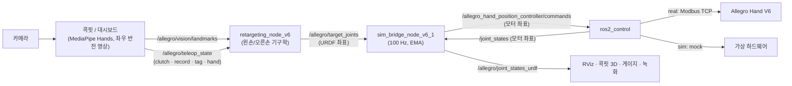

# Allegro Hand Vision Teleoperation

단일 RGB 카메라(웹캠 또는 Intel RealSense)와 MediaPipe Hands로 작업자의 손동작을 추적해 Wonik Robotics **Allegro Hand V6 (5지, 20-DOF)** 를 원격 조종하는 ROS 2 Humble 패키지입니다. 왼손/오른손 로봇을 모두 지원하며, VLA 학습용 데이터셋 녹화 기능을 포함합니다. Allegro Hand V4 (4지, 16-DOF)용 런처도 함께 들어 있습니다.

---

## 목차
1. [주요 기능](#주요-기능)
2. [빠른 실행](#빠른-실행)
3. [설치](#설치)
4. [시스템 구조](#시스템-구조)
5. [왼손/오른손 처리](#왼손오른손-처리)
6. [실행 옵션](#실행-옵션)
7. [단축키](#단축키)
8. [데이터셋 녹화](#데이터셋-녹화)
9. [트러블슈팅](#트러블슈팅)

---

## 주요 기능
- **양손 지원**: 연결된 로봇이 왼손인지 오른손인지 하드웨어에서 자동 감지하고, 손에 맞는 리타게팅·URDF·관절 한계를 사용합니다.
- **100 Hz 명령 송출 + EMA 필터**: 카메라 FPS와 무관하게 일정 주기로 명령을 보내고, 저역 통과 필터로 떨림을 줄입니다.
- **두 가지 UI**
  - **콕핏**: 카메라 영상, 3D 로봇 손(URDF STL 메쉬), 관절 게이지를 창 하나에 표시합니다. 3D 뷰는 NVIDIA GPU로 렌더링합니다.
  - **대시보드**: 카메라 영상과 관절 게이지 창에 RViz2 창이 따로 뜹니다.
- **호스트/도커 자동 전환**: 호스트에서 런처를 실행하면 `ros_humble_dev` 컨테이너 안으로 자동 진입하고 GUI를 호스트 화면에 띄웁니다.

---

## 빠른 실행

> **폴더 위치는 고정입니다.** 런처는 호스트에서 실행되면 컨테이너 안의 `/home/humble_ws/allegro_vision_teleop/`에서 자신을 다시 실행합니다. 따라서 이 저장소는 반드시 **`~/humble_ws/allegro_vision_teleop`** 에 두고, 컨테이너에는 `~/humble_ws`를 `/home/humble_ws`로 마운트해야 합니다([설치](#설치) 참고). 이 구조만 지키면 아래 명령은 어느 디렉토리에서 실행해도 동작합니다.

```bash
~/humble_ws/allegro_vision_teleop/check_hand.sh                          # 로봇 통신·손 종류·엔코더 확인 (ROS 불필요)
~/humble_ws/allegro_vision_teleop/run_cockpit_v6_3.sh real               # 콕핏 UI (권장)
~/humble_ws/allegro_vision_teleop/run_dashboard_v6_1.sh real             # 대시보드 + RViz2
~/humble_ws/allegro_vision_teleop/run_v6_3.sh real --cockpit --record    # 콕핏 + 데이터셋 녹화
~/humble_ws/allegro_vision_teleop/run_cockpit_v6_3.sh sim --hand left    # 로봇 없이 시뮬레이션 (sim은 자동 감지가 없어 --hand 지정)
```

컨테이너 안(`docker exec -it ros_humble_dev bash`)에서 실행할 때는 경로만 `/home/humble_ws/allegro_vision_teleop/...`로 바꿉니다.

```bash
/home/humble_ws/allegro_vision_teleop/run_cockpit_v6_3.sh real
```

- `real` 모드에서는 손 종류가 자동 감지됩니다. 런처 로그의 `[✓] Hardware auto-detected hand type: ...` 줄로 확인하고, 감지에 실패하면 `--hand left|right`를 지정합니다. **왼손 로봇을 오른손 모드로 구동하면 손가락이 90° 굽혀지므로** 감지 결과를 꼭 확인하세요.
- 종료는 런처를 실행한 터미널에서 `Ctrl+C`를 누릅니다.

> 저장소에는 이전 버전 파일(`*_v6.*`, `*_v6_1.*`, `*_v6_2.*`)이 비교용으로 남아 있습니다. 실행은 위 명령어를 사용하세요.

---

## 설치

### 0. 폴더 구조
```bash
mkdir -p ~/humble_ws/src
git clone https://github.com/jacoblee1214/allegro_vision_teleop.git ~/humble_ws/allegro_vision_teleop
# Wonik Allegro Hand V6 ROS 2 패키지는 ~/humble_ws/src/allegro_hand_v6/ 에 둡니다 (3단계 참고)
```
```text
~/humble_ws/                       → 컨테이너의 /home/humble_ws
├── allegro_vision_teleop/         (이 저장소)
└── src/allegro_hand_v6/           (Wonik 드라이버 패키지)
```

### 1. 하드웨어 연결
- 로봇에 24 V 전원을 연결합니다.
- PC 유선 LAN을 로봇과 같은 서브넷으로 설정합니다. 예: `192.168.1.10/24` (로봇 기본 주소 `192.168.1.100:502`, Modbus TCP)
- `ping 192.168.1.100`으로 연결을 확인합니다. 다른 주소를 쓰면 `--ip`로 지정합니다.

### 2. Docker 컨테이너
```bash
xhost +local:docker

docker run -it -d \
  --name ros_humble_dev \
  --privileged --net=host \
  --runtime=nvidia -e NVIDIA_VISIBLE_DEVICES=all -e NVIDIA_DRIVER_CAPABILITIES=all \
  -e DISPLAY=$DISPLAY \
  -v /tmp/.X11-unix:/tmp/.X11-unix:rw \
  -v $HOME/humble_ws:/home/humble_ws:rw \
  osrf/ros:humble-desktop

docker exec -it ros_humble_dev bash -c "
  apt-get update && apt-get install -y \
    ros-humble-ros2-control ros-humble-ros2-controllers \
    ros-humble-rmw-cyclonedds-cpp ros-humble-rviz2 \
    v4l-utils python3-pip && \
  pip3 install -r /home/humble_ws/allegro_vision_teleop/requirements.txt
"
```
NVIDIA GPU가 없는 PC에서는 `--runtime=nvidia` 관련 옵션을 빼면 됩니다. 콕핏 3D 뷰는 자동으로 CPU 렌더링으로 전환됩니다(느림).

### 3. Wonik 드라이버 패키지 + 패치
`~/humble_ws/src/allegro_hand_v6/`에 Wonik Robotics의 Allegro Hand V6 ROS 2 패키지(`allegro_hand_v6_description`, `allegro_hand_v6_bringup`, `allegro_hand_v6_hardware`)를 둔 뒤, 이 저장소의 패치 파일을 추가합니다. 원본 파일은 수정하지 않고 새 파일만 추가합니다.

```bash
cp -r ~/humble_ws/allegro_vision_teleop/wonik_patch_v6_1/* \
      ~/humble_ws/src/allegro_hand_v6/allegro_hand_v6_bringup/

docker exec -it ros_humble_dev bash -c "
  source /opt/ros/humble/setup.bash && cd /home/humble_ws && colcon build --symlink-install
"
```

| 패치 파일 | 내용 |
|---|---|
| `launch/allegro_hand_v6_1.launch.py` | `joint_states_topic` 인자 추가. `robot_state_publisher`(RViz)가 URDF 좌표계 관절 상태를 받도록 remap |
| `config/single_hand/allegro_hand_v6_1.urdf.xacro` | 아래 ros2_control xacro를 사용하고 `hand` 인자를 전달 |
| `config/single_hand/allegro_hand_v6_1.ros2_control.xacro` | 왼손 실물 구동 시 MCP 관절(joint11/21/31/41) 초기 명령을 -π/2로 설정 → 전원 인가 직후부터 손가락이 펴진 자세로 시작 |

---

## 시스템 구조



| 파일 | 역할 |
|---|---|
| `run_teleop_v6_3.sh` / `run_v6_3.sh` | 통합 런처 (하드웨어 감지, 노드 기동, 도커 자동 진입) |
| `run_cockpit_v6_3.sh`, `run_dashboard_v6_1.sh` | UI별 런처 |
| `teleop_cockpit_v6_3.py` | 콕핏 UI (카메라 + MediaPipe + OpenGL 3D 뷰) |
| `teleop_dashboard_v6_1.py` | 대시보드 UI (RViz2와 함께 사용) |
| `retargeting_node_v6.py` | 랜드마크 → 20관절 목표각 (왼손/오른손 별도 파이프라인) |
| `sim_bridge_node_v6_1.py` | 100 Hz 명령 송출, EMA 필터, URDF ↔ 모터 좌표 변환 |
| `dataset_recorder_v6_1.py` | 에피소드 녹화 |
| `safety_utils_v6.py` | 관절 순서·한계 정의 |
| `check_hand.sh` / `check_hand.py` | 로봇 통신 진단 |
| `wonik_patch_v6_1/` | Wonik bringup 패키지 추가 파일 |

---

## 왼손/오른손 처리

- **손 감지**: `real` 모드에서 로봇의 하드웨어 레지스터를 읽어 왼손/오른손을 판별하고, 그 값을 리타게팅·브릿지·UI·launch에 똑같이 전달합니다.
- **조종 손**: 로봇 왼손은 작업자 왼손으로, 로봇 오른손은 작업자 오른손으로 조종합니다. 반대 손을 쓰면 손가락 굽힘이 인식되지 않습니다.
- **리타게팅**: 왼손/오른손 손가락 파이프라인은 서로 거울 대칭입니다. 굽힘은 같은 값이고, 벌림은 부호가 반대입니다. 엄지는 손별로 따로 튜닝되어 있습니다.
- **URDF 좌표계**: 모든 관절은 0 rad에서 손가락이 곧게 펴지고, 양수 값이 손바닥 쪽 굽힘입니다.
- **왼손 MCP 모터 오프셋**: 왼손 실물의 MCP 모터(joint11/21/31/41)는 손가락이 펴졌을 때 -π/2를 읽도록 영점이 잡혀 있습니다. 이 변환은 `sim_bridge_node_v6_1.py` 한 곳에서만 합니다.

| 경로 | 변환 (real + 왼손, joint11/21/31/41) |
|---|---|
| 명령: `/allegro/target_joints` → 컨트롤러 | −π/2 |
| 피드백: `/joint_states` → `/allegro/joint_states_urdf` | +π/2 |

RViz, 콕핏 3D 뷰, 게이지, 데이터셋 녹화는 모두 `/allegro/joint_states_urdf`를 구독합니다. 그래서 화면과 녹화 데이터는 항상 URDF 좌표계입니다. `sim` 모드와 오른손은 변환 없이 그대로 전달합니다.

---

## 실행 옵션

`run_v6_3.sh [nodes|sim|real] [options]` (`run_cockpit_v6_3.sh`, `run_dashboard_v6_1.sh`도 같은 옵션 사용)

| 옵션 | 설명 | 기본값 |
|---|---|---|
| `real` / `sim` / `nodes` | 실물 로봇 / 가상 하드웨어 / 텔레옵 노드만 | `nodes` |
| `--cockpit` | 콕핏 UI | |
| `--classic` | 대시보드 + RViz2 | 기본 UI |
| `--simple-gui` | MediaPipe OpenCV 창만 | |
| `--no-gui` | GUI 없이 실행 | |
| `--rviz` / `--no-rviz` | RViz2 창 강제 on/off | UI에 따라 자동 |
| `--hand left\|right` | 손 종류 지정 (`real`은 자동 감지) | `right` |
| `--ip <주소>` | 로봇 IP (`101` 또는 `192.168.1.101` 형식) | 자동 탐색 |
| `--rate <Hz>` | 로봇 명령 송출 주기 | `100` |
| `--alpha <0~1>` | EMA 필터 계수 (작을수록 부드럽고 느림) | `0.25` |
| `--fps <int>` | 카메라 캡처 FPS | `60` |
| `--device <int>` | 카메라 장치 번호 | 자동 감지 |
| `--scale <float>` | `--simple-gui` 창 배율 | `1.75` |
| `--record` | 데이터셋 녹화 노드 실행 | 꺼짐 |

---

## 단축키

UI 창이 활성화된 상태에서 사용합니다.

| 키 | 기능 |
|---|---|
| `C` | 클러치: 추적을 일시정지하고 로봇을 현재 자세로 유지 |
| `R` | 에피소드 녹화 시작/중지 (`--record` 필요) |
| `S` / `F` | 녹화한 에피소드를 성공 / 실패로 태그해 저장 |
| `H` | 손 모델 전환 (`sim`·`nodes` 모드 전용. `real`에서는 실물 손이 고정이라 비활성) |
| `Q` / `Esc` | UI 종료 |

- 콕핏 3D 뷰 조작: 좌클릭 드래그로 회전, 우클릭 드래그로 이동, 휠로 확대/축소, 더블클릭으로 기본 시점(RViz 기본 시점과 동일) 복귀.
- 3D 뷰에서 엄지·검지 끝이 노랗게 변하는 것은 핀치 표시(카메라 속 엄지-검지 끝이 가까울 때)입니다. 로봇 제어와는 무관합니다.

---

## 데이터셋 녹화

`--record`로 실행하고 `R`로 녹화, `S`/`F`로 태그합니다.

- 저장 위치(컨테이너 기준): `/home/humble_ws/pinn_hw/results/episodes/`
- 형식: 에피소드별 JSON 파일과 `manifest.json`
- 기록 항목: 관절 목표각(action), 실제 관절 상태(state), MediaPipe 3D 랜드마크, 클러치 상태. state와 action은 모두 URDF 좌표계입니다.

---

## 트러블슈팅

**통신 확인**: `./check_hand.sh`는 ROS 없이 소켓으로 로봇에 접속해 통신 상태, 손 종류, 20관절 엔코더 값을 출력합니다.

**로봇 연결 실패 (RViz에서 손이 흩어져 보이거나 관절이 움직이지 않음)**
1. 24 V 전원과 LAN 케이블을 확인합니다.
2. PC LAN 주소가 로봇과 같은 서브넷인지 확인합니다.
3. `ping`이 응답하면 런처를 다시 실행합니다.

**카메라가 켜지지 않음 / `Device or resource busy`**
- 이전 세션이 정상 종료되지 않아 카메라를 잡고 있는 경우입니다. 이전 런처 터미널에서 `Ctrl+C`로 종료하세요. 런처는 시작할 때 남아 있는 텔레옵 UI 프로세스를 자동으로 정리합니다.
- `--device <번호>`로 다른 카메라를 지정할 수 있습니다.

**호스트에서 파이썬 파일을 직접 실행하면 `ModuleNotFoundError`**
- 의존성은 컨테이너 안에만 설치되어 있습니다. 런처(`run_*.sh`)를 사용하면 자동으로 컨테이너 안에서 실행됩니다.

**왼손 로봇의 손가락이 켜자마자 90° 굽혀짐**
- 오른손 모드로 실행된 경우입니다. 런처 로그의 손 감지 결과를 확인하고, 필요하면 `--hand left`로 실행합니다.

---

## Allegro Hand V4 (4지, 16-DOF)

```bash
./run_v4.sh real   # SocketCAN can0 활성화 필요
./run_v4.sh sim
```
