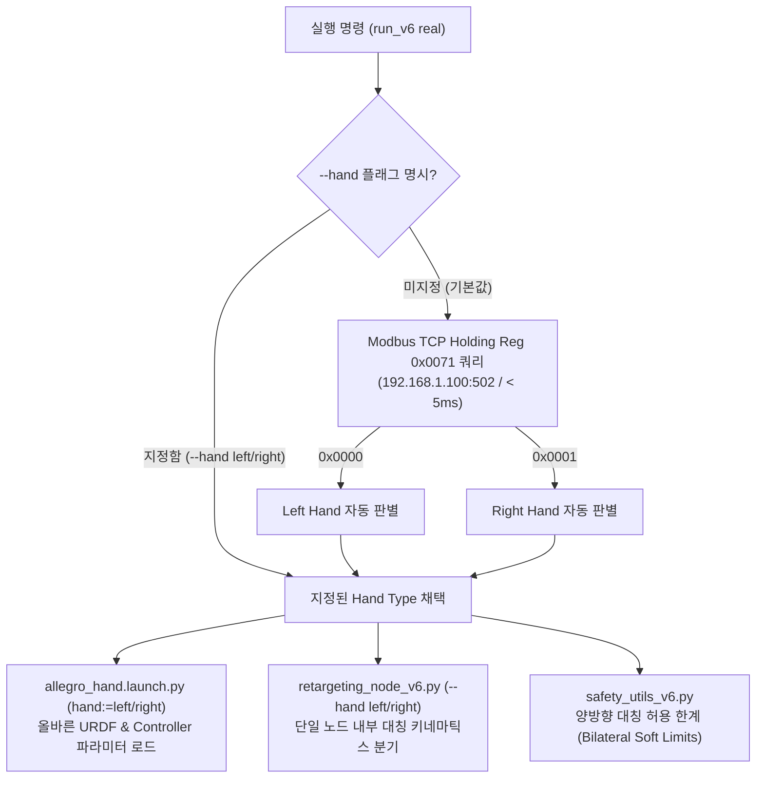
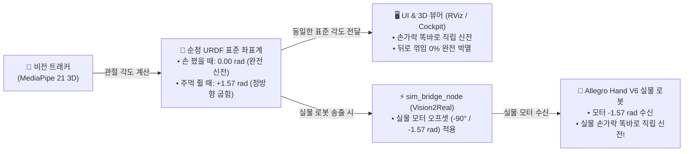
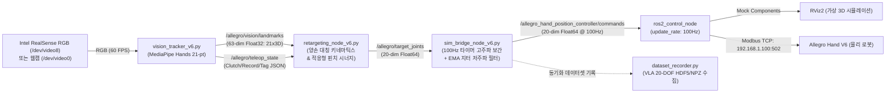

# Allegro Hand Vision Retargeting & Teleoperation System
> Wonik Robotics **Allegro Hand V6 (5-Finger, 20-DOF)** & **Allegro Hand V4 (4-Finger, 16-DOF)**  
> 양손(Left/Right) 통합 기구학 리타게팅, 실시간 비전 원격 제어, 하드웨어 텔레메트리 & VLA 데이터셋 수집 파이프라인

---

## 📑 목차 (Table of Contents)
1. [프로젝트 개요 (Overview)](#-프로젝트-개요-overview)
2. [💡 양손(Left/Right) 통합 아키텍처 및 원리 (인수인계 필독)](#-양손leftright-통합-아키텍처-및-원리-인수인계-필독)
3. [⚡ 원익 V6 펌웨어 토크/전류 시퀀스 (Firmware Protocol)](#-원익-v6-펌웨어-토크전류-시퀀스-firmware-protocol)
4. [🛠️ 하드웨어 자가진단 및 검증 도구 (Diagnostic Tools)](#️-하드웨어-자가진단-및-검증-도구-diagnostic-tools)
5. [📌 시스템 아키텍처 및 데이터 흐름 (Architecture & Dataflow)](#-시스템-아키텍처-및-데이터-흐름-architecture--dataflow)
6. [💻 설치 환경 및 Docker 재현 가이드 (Setup & Prerequisites)](#-설치-환경-및-docker-재현-가이드-setup--prerequisites)
7. [🚀 실행 가이드 (Quick Start)](#-실행-가이드-quick-start)
8. [⚙️ CLI 실행 옵션 상세 (Command-line Options)](#️-cli-실행-옵션-상세-command-line-options)
9. [🔍 트러블슈팅 가이드 (Troubleshooting)](#-트러블슈팅-가이드-troubleshooting)

---

## 📖 프로젝트 개요 (Overview)

본 레포지토리는 단일 RGB 카메라(Intel RealSense 또는 웹캠)와 MediaPipe Hands를 활용하여 작업자의 손동작을 실시간으로 추적하고, Wonik Robotics의 5지 로봇 의수/매니퓰레이터인 **Allegro Hand V6 (20자유도)** 및 4지 **Allegro Hand V4 (16자유도)**에 정밀하게 투영(Retargeting)하는 엔드투엔드 원격 제어(Teleoperation) ROS 2 패키지입니다.

### ✨ 핵심 기능 및 차별점
- **양손 통합 파이프라인 (Unified Bilateral Pipeline)**: 왼손/오른손 코드를 별도로 분리하지 않고, 하드웨어 레지스터 자동 감지 및 단일 노드 내부 부호 변환을 통해 완전 통합 관리.
- **엄지 4자유도 적응형 시너지 (Adaptive Thumb Grasp/Pinch Synergy)**: 외전(Opposition), 대립각, MCP/IP 굴곡의 비선형 가중치 매핑을 통해 정밀 핀치(Pinch) 및 파워 그립(Power Grasp) 구현.
- **60Hz / 100Hz 고주파 보간 및 지터 억제**: 카메라 FPS와 무관하게 제어 주기를 100Hz로 독립 구동하고 1차 IIR EMA 필터를 적용하여 모터 떨림(Tremor) 완전 박멸.
- **원터치 올인원 런처 (`run_v6`, `run_v4`)**: 호스트/도커 환경 자동 감지, 이더넷 네트워크 프리플라이트 점검, 하드웨어 모델 자동 판별, X11 GUI 포워딩 자동화.
- **PyQt5 통합 텔레옵 대시보드 & VLA 레코더**: 실시간 20관절 각도 게이지, 클러치(일시정지), 에피소드 녹화(R) 및 태그(S) 기능 내장.

---

## 💡 양손(Left/Right) 통합 아키텍처 및 원리 (인수인계 필독)

### Q. "왼손 버전과 오른손 버전 코드를 따로 분리해서 만들어야 하나요?"
> **답변: 절대 분리하지 않습니다 (NO). 단일 통합 파이프라인(Unified Pipeline)으로 유지해야 합니다.**
>
> 왼손과 오른손용으로 스크립트나 패키지를 복제(`allegro_left`, `allegro_right` 등)하면 이후 버그 수정, 제어 알고리즘 튜닝, 필터 파라미터 개선 시 매번 양쪽 코드를 수동 동기화해야 하며, 유지보수 비용과 인적 오류 위험이 기하급수적으로 증가합니다. 본 시스템은 아래와 같은 3단계 통합 설계로 양손을 완벽히 지원합니다.



### 1. 하드웨어 레벨 아이덴티티 (Modbus Register 0x0071)
Wonik Allegro Hand V6 내부 제어기(MCU) 비휘발성 메모리에는 손의 형상이 영구 기록되어 있습니다:
- **Holding Register `0x0071`**:
  - `0x0000` (0) : **Left Hand (왼손)**
  - `0x0001` (1) : **Right Hand (오른손)**
- **Holding Register `0x0318 ~ 0x031B` (8바이트 ASCII)**:
  - 시리얼 번호 모델 식별 (`LA`는 Left Allegro, `RA`는 Right Allegro)
- `run_teleop_v6.sh`는 `real` 모드 진입 시 소켓 통신을 통해 `0x0071` 레지스터를 5ms 내에 단발 조회하여 연결된 하드웨어 타입을 자동 식별합니다.

### 2. 완전 독립 듀얼 파이프라인 아키텍처 (Isolated Dual-Pipeline Architecture)
> **핵심 원칙: 왼손과 오른손의 연산 파이프라인, 캘리브레이션, 관절 한계는 100% 상호 격리됩니다.**
- **오른손 (`_retarget_right_hand`)**: 기존 100% 검증 완료된 순정 기구학 및 `JOINT_LIMITS_RIGHT`를 보존하여, 왼손 튜닝에 의한 사이드 이펙트나 오동작이 일절 발생하지 않습니다.
- **왼손 (`_retarget_left_hand`)**: 왼손 하드웨어 모터 극성 및 왼손 관절 한계(`JOINT_LIMITS_LEFT`)에 맞춘 전용 파이프라인으로 독립 동작합니다.
- **필터 상태 분리**: UI 또는 CLI에서 손 모드 전환 시, 이전 손의 필터 히스토리(`_filtered_q`)를 즉시 리셋하여 모델 전환 시 튀는 현상을 원천 방지합니다.

| 관절 번호 | 기구학적 명칭 | 오른손 (Right Hand) 동작 | 왼손 (Left Hand) 동작 |
|---|---|---|---|
| **`joint00`** | Base Opposition (엄지 1번째: 대립/외전) | 대립 시 **양수(`+0.05 ~ +1.40 rad`)** | 대립 시 **음수(`-0.05 ~ -1.40 rad`)**<br/>*(검지 방향으로 손바닥 전면 스윕)* |
| **`joint01`** | Elevation / Inward Swing (엄지 2번째: 거상/스윙) | 손바닥 쪽 스윙 시 **음수(`-0.10 ~ -0.75 rad`)** | 검지 방향 거상 시 **음수(`-0.20 ~ -1.50 rad`)**<br/>*(최대 1.50 rad / ~86° 대폭 상향 거상)* |
| **`joint02`** | MCP Flexion (엄지 3번째: 기저 굽힘) | 굽힘 시 **양수(`0.0 ~ +1.20 rad`)** | 굽힘 시 **양수(`0.0 ~ +1.40 rad`)** |
| **`joint03`** | IP Flexion (엄지 4번째: 끝마디 굽힘) | 굽힘 시 **양수(`0.0 ~ +1.30 rad`)** | 굽힘 시 **양수(`0.0 ~ +1.40 rad`)** |
| **`joint10~40`** | Finger Abduction (4지 1번째: 좌우 벌림) | 외전 벌림 시 검지 양수/소지 음수 | 외전 벌림 시 검지 음수/소지 양수<br/>*(자연스러운 외측 방사형 벌림)* |
| **`joint11~41`** | MCP Flexion (4지 2번째: 손바닥 기저 굽힘) | 굽힘 시 **양수(`0.0 ~ +1.57 rad`)** | **평면 투영 기법 적용: 손 폈을 때 0.00 rad 직립 신전**, 주먹 쥘 때 양수(`0.0 ~ +1.57 rad`) 굽힘 |
| **`joint12~42`** | PIP Flexion (4지 3번째: 중간 마디 굽힘) | 굽힘 시 **양수(`0.0 ~ +1.40 rad`)** | 굽힘 시 **양수(`0.0 ~ +1.40 rad`)** |
| **`joint13~43`** | DIP Flexion (4지 4번째: 끝 마디 굽힘) | 굽힘 시 **양수(`0.0 ~ +1.40 rad`)** | 굽힘 시 **양수(`0.0 ~ +1.40 rad`)** (인위적 커플링 제거) |

### 3. 🛡️ Vision2Real 기구학 정합 원리 (CAD 순정 URDF 보존 & 모터 오프셋 분리)
> **"왜 URDF 원본을 건드리지 않고, 제어 브릿지에서 모터 오프셋을 처리해야 하는가?"**
>
> 향후 xArm7 등 매니퓰레이터 로봇 팔과 핸드를 결합하여 전체 상체(Arm+Hand) 역기구학(IK/FK) 및 모션 플래닝을 수행할 때, 손 모델의 원점이나 회전축이 비표준으로 변경되어 있으면 매니퓰레이션 기구학 체인이 완전히 꼬이게 됩니다. 따라서 본 시스템은 **Vision2Real 기초를 완벽히 정립**하여 동작합니다:



1. **URDF 및 비전 리타게팅의 순정 표준화**:
   - `urdf/allegro_hand_v6_left.urdf`는 원익 공식 CAD 원본 그대로 `lower="-0.0698132" upper="1.5707963"`를 유지합니다.
   - `retargeting_node_v6.py`는 손을 폈을 때 `0.00 rad` (직립 신전), 접을 때 `0.0 ~ +1.57 rad`를 출력합니다.
   - 따라서 **RViz2 및 3D Cockpit 위젯에서 손가락이 손등 뒤로 꺾이지 않고 하늘을 향해 곧게 펴진 완벽한 기본 디폴트 자세**를 유지합니다.
2. **실물 로봇 모터 오프셋의 완벽 분리 (`sim_bridge_node_v6.py`)**:
   - 실물 로봇 하드웨어의 모터 영점은 기계적으로 90도 굽혀진 상태입니다.
   - 따라서 `sim_bridge_node_v6.py`가 `real` 모드에서 실물 로봇(`allegro_hand_position_controller/commands`)으로 명령을 쏠 때만 **`-90도(-1.5708 rad)`**를 적용하여 송출합니다.
   - 결과: **URDF 시각화도 똑바로 펴지고, 실물 로봇 손도 똑바로 펴지며 1:1로 완벽 동기화**됩니다!

---

### 4. UI 실시간 양손 전환 및 모델 즉시 갱신 (Live UI & Model Sync)
- **콕핏 대시보드 (`teleop_cockpit_v6.py` / `teleop_dashboard_v6.py`)** 내에 **`HAND: [ ✋ LEFT HAND (왼손) ]` / `[ 🤚 RIGHT HAND (오른손) ]`** 상태 카드 및 원클릭 전환 버튼이 탑재되었습니다.
- 단축키 **`H` (Switch Hand)** 또는 버튼을 누르면:
  1. 리타게팅 노드의 키네마틱스 연산이 실시간으로 전환됩니다 (필터 자동 리셋).
  2. 제어 브릿지 노드의 Vision2Real 모터 오프셋이 즉시 활성화/비활성화됩니다.
  3. **3D 로봇 모델(`/robot_description`)과 `robot_state_publisher`의 TF 좌표계가 재시작 없이 화면에서 즉시 왼손 ↔ 오른손으로 바뀝니다.**
- 기본 디폴트는 **`right` (오른손)**이며, 로봇 연결 시 하드웨어 레지스터를 통해 자동 감지됩니다.

---

## ⚡ 원익 V6 펌웨어 토크/전류 시퀀스 (Firmware Protocol)

원익 로보틱스 Allegro Hand V6의 내장 펌웨어(`v3.0.0`, `0x0300`)는 독특한 안전 시퀀스를 요구합니다. 하드웨어 드라이버 개발 및 저수준 통신 시 아래 사항을 반드시 숙지해야 합니다:

1. **토크 ON 직후 목표 전류 초기화 방지**:
   - Modbus Coil `0x0000` (`TORQUE_ENABLE`)을 `1`로 쓰면, 내부 펌웨어가 안전을 위해 관절의 기본 목표 전류(`CMD_CUR`)를 **4~5mA (사실상 0A)** 수준으로 리셋합니다.
   - 따라서 토크를 켠 직후, 반드시 **Holding Register `0x0114 ~ 0x0127` (`CMD_CUR`)에 적정 구동 전류(200 ~ 250 mA)를 재인가**해야 관절 정지 마찰력(Stiction)을 극복하고 모터가 위치 목표값으로 부드럽게 기동합니다.
   - 본 패키지의 `ros2_control` 하드웨어 인터페이스와 진단 스크립트는 이 시퀀스를 자동으로 준수하도록 작성되었습니다.

---

## 🛠️ 하드웨어 자가진단 및 검증 도구 (Diagnostic Tools)

로봇 핸드가 정상 동작하지 않거나 비전 연동 전 하드웨어 단독 상태를 검증하고자 할 때 즉시 사용할 수 있는 도구들입니다.

### 1. 엄지 4관절 정밀 구동 및 텔레메트리 진단기 (`test_thumb.py`)
엄지 4개 관절(`joint00 ~ 03`)의 통신, 토크, 6단계 모션 궤적 추종 오차, 온도, 통신 에러를 1초 만에 검증합니다.

```bash
# 호스트 터미널에서 즉시 실행
python3 ~/test_thumb.py
# (또는 python3 /home/jake/humble_ws/allegro_vision_teleop/demo_thumb_poses.py)
```
- **검증 항목**:
  - `0x0000` (토크 활성화) 및 `0x0114` (200mA 정격 전류 인가)
  - 6단계 포즈 순회: `OPEN_HOME` -> `SWING_FORWARD` -> `TIP_CURL` -> `OPPOSITION_SWEEP` -> `DEEP_PINCH` -> `RETURN_HOME`
  - 추종 오차: 관절당 평균 **0.9° 미만**의 정밀 추종 확인
  - 텔레메트리 출력: 모터 오류 플래그(`0x0000`), 통신 실패 0건, 모터 온도(33~35°C 정상 범위)

### 2. 원익 로보틱스 공식 하드웨어 GUI (`run_v6_gui.sh`)
원익 로보틱스에서 제공하는 공식 PyQt 진단 GUI를 호스트 환경에서 즉시 구동합니다.

```bash
# 호스트 터미널에서 실행
~/run_v6_gui.sh
# (또는 /home/jake/humble_ws/allegro_vision_teleop/run_gui.sh)
```
- **주요 기능**:
  - 20개 관절별 실시간 위치/전류/온도 모니터링 그래프
  - 관절별 개별 P/I/D 게인 튜닝 및 플래시 메모리 저장
  - 데모 파지 모션(Grasp, Pinch, Spread) 원클릭 테스트
  - 비정상 과전류 셧다운 시 오류 코드 확인 및 리셋

---

## 📌 시스템 아키텍처 및 데이터 흐름 (Architecture & Dataflow)



---

## 💻 설치 환경 및 Docker 재현 가이드 (Setup & Prerequisites)

새로운 PC나 연구원에게 인수인계 시 그대로 복사하여 환경을 구축할 수 있는 절차입니다.

### 1. 하드웨어 및 이더넷 연결
- **전원**: 24V DC (정격 5A 이상) 파워서플라이 연결 후 로봇 전원 ON.
- **PC 유선 랜카드 IP 설정**:
  - IP: `192.168.1.10`
  - Subnet Mask: `255.255.255.0` (`/24`)
  - 로봇 핸드 기본 IP: `192.168.1.100` (Modbus TCP Port: `502`)
- **네트워크 핑 확인**:
  ```bash
  ping -c 2 192.168.1.100
  ```

### 2. Docker 컨테이너 생성 및 실행
본 시스템은 호스트의 드라이버 충돌을 방지하고 완벽한 재현성을 제공하기 위해 `ros_humble_dev` 컨테이너에서 동작합니다.

```bash
# 1. 호스트 X11 GUI 접근 허용
xhost +local:docker

# 2. 도커 컨테이너 생성 (최초 1회)
docker run -it -d \
  --name ros_humble_dev \
  --privileged \
  --net=host \
  -e DISPLAY=$DISPLAY \
  -v /tmp/.X11-unix:/tmp/.X11-unix:rw \
  -v /home/jake/humble_ws:/home/humble_ws:rw \
  osrf/ros:humble-desktop

# 3. 필수 의존성 일괄 설치 (컨테이너 내부)
docker exec -it ros_humble_dev bash -c "
  apt-get update && apt-get install -y \
    ros-humble-ros2-control \
    ros-humble-ros2-controllers \
    ros-humble-joint-state-broadcaster \
    ros-humble-position-controllers \
    ros-humble-rmw-cyclonedds-cpp \
    ros-humble-tf2-ros \
    ros-humble-rviz2 \
    v4l-utils can-utils python3-pip && \
  pip3 install mediapipe==0.10.14 opencv-python numpy scipy PyQt5 pymodbus
"
```

### 3. ROS 2 워크스페이스 빌드
```bash
docker exec -it ros_humble_dev bash -c "
  source /opt/ros/humble/setup.bash && \
  cd /home/humble_ws && \
  colcon build --symlink-install
"
```

---

## 🚀 실행 가이드 (Quick Start)

어디서든 간편하게 실행할 수 있도록 용도별 전용 런처 스크립트와 올인원 런처(`run_v6`)를 모두 제공합니다. 이전 버전(클래식 대시보드 + RViz2)과 신규 버전(단일 창 통합 3D 콕핏)을 필요에 따라 언제든 돌려가며 사용할 수 있습니다.

> [!TIP]
> ### ⚡ 실행 방법 요약 (어떤 GUI를 쓸지 선택하여 1초 실행)
>
> **1. 🖥️ [신규] 통합 3D 콕핏 UI (단일 윈도우 - 창 1개로 완결)**
> - 카메라 영상 옆 중앙에 실시간 3D 로봇 핸드가 내장되어 있어 **별도의 RViz2 창 없이 단 1개의 창으로 완결**됩니다.
> ```
> ┌─────────────────────────┬─────────────────────────┬─────────────────────────┐
> │ [좌측] 🎥 카메라 영상     │ [중앙] 🤖 3D 로봇 핸드   │ [우측] 🎮 계측 및 제어    │
> │ • 웹캠/리얼센스 RGB 영상    │ • 순정 URDF 실시간 3D 손   │ • 20-DOF 실시간 각도 바 │
> │ • MediaPipe 21개 스켈레톤  │ • 마우스 드래그 360° 회전 │ • 왼손/오른손 [H] 전환  │
> │ • 핀치 거리 실시간 측정   │ • 마우스 휠 줌 인/아웃   │ • Clutch [Space] 고정   │
> │ • 트래킹 상태 인디케이터 │ • 더블클릭 뷰포트 리셋  │ • Record [R] / Tag [S]  │
> └─────────────────────────┴─────────────────────────┴─────────────────────────┘
> ```
> ```bash
> # 실물 로봇 연결 시 (하드웨어 및 왼손/오른손 자동 감지)
> ./run_cockpit.sh real
>
> # 시뮬레이션 테스트 시 (로봇 없이 가상 3D 손 확인)
> ./run_cockpit.sh sim
> ```
> *(동일 명령어: `run_v6 real --cockpit` 또는 `run_v6 sim --cockpit`)*
>
> ---
>
> **2. 📊 [클래식] 2D 텔레옵 대시보드 + RViz2 분리 창 모드 (기존 방식)**
> - 20-DOF 관절별 상세 각도 게이지 바와 공식 RViz2 창이 함께 실행되어 상세 텔레메트리를 분리 모니터링합니다.
> ```
> ┌───────────────────────────────────────────────┬───────────────────────────────────────────────┐
> │ [LEFT] Live Camera View & Hand Tracking       │ [RIGHT] 20-DOF Joint Telemetry & Cockpit Ctrl │
> │ • RealSense / Webcam RGB Feed (60 FPS)        │ • Thumb, Index, Middle, Ring, Pinky           │
> │ • MediaPipe 21 3D Landmarks & Skeleton        │ • Normalized angle gauge bars & rad values    │
> │ • Live Pinch Metric (d_pinch in cm)           │ • Clutch [Space], Record [R], Tag [S]         │
> └───────────────────────────────────────────────┴───────────────────────────────────────────────┘
>                                  + [Separate Window] ROS 2 RViz2 (RobotModel)
> ```
> ```bash
> # 실물 로봇 연결 시
> ./run_dashboard.sh real
>
> # 시뮬레이션 테스트 시
> ./run_dashboard.sh sim
> ```
> *(동일 명령어: `run_v6 real` 또는 `run_v6 real --classic`)*
>
> ---
>
> **3. 🖐️ 손 모델(Hand Side) 선택 및 자동 감지**
> - **기본값 (Default)**: **`right` (오른손)**
> - **자동 감지**: `real` 모드 실행 시 로봇의 Modbus TCP 레지스터(`0x0071`)를 5ms 내에 자동 조회하여, 연결된 로봇이 왼손이면 자동으로 `left`로 전환됩니다.
> - **수동 지정**: 필요 시 `--hand left` 또는 `--hand right`를 붙여 강제 실행 가능:
>   ```bash
>   ./run_cockpit.sh real --hand left
>   ./run_dashboard.sh real --hand right
>   ```
> - **실시간 전환**: GUI 실행 중에도 키보드 **`H`** 키 또는 화면 상단의 **`Switch Hand [H]`** 버튼을 누르면 재시작 없이 즉시 전환됩니다.
>
> ---
>
> **4. 🌐 스마트 IP 자동 탐색**
> - 기본 IP `192.168.1.100` 외에도 연구실 내 사용되는 `192.168.1.201` 등을 시작 시 자동 검색하여, 사용자가 `--ip` 옵션을 주지 않아도 연결된 로봇에 자동으로 바인딩됩니다.

---

### 🎮 텔레옵 대시보드 단축키 안내 (Keyboard Shortcuts)
프로그램 실행 후 카메라/대시보드 창이 활성화된 상태에서 아래 키를 누르면 즉시 기능이 동작합니다:

| 단축키 | 기능 명칭 | 상세 설명 |
|---|---|---|
| **`H`** | **손 모드 전환 (Hand Switch)** | **왼손(LEFT) ↔ 오른손(RIGHT)** 기구학 파이프라인 및 3D 모델 실시간 즉각 전환 |
| **`Space`** | **클러치 홀드 (Clutch Hold)** | 작업자가 손을 화면 밖으로 치우거나 쉴 때, **로봇 관절을 현재 위치에 안전하게 고정(Freeze)** |
| **`R`** | **에피소드 녹화 (Record)** | VLA 로봇 학습용 20-DOF 관절 데이터셋 녹화 시작 및 저장 종료 (`--record` 옵션 시) |
| **`S`** | **성공 태깅 (Success Tag)** | 조작 태스크 성공 시점에 데이터셋 플래그 태깅 |
| **`Ctrl + C`** | **안전 일괄 종료 (Exit)** | 모든 백그라운드 노드, 카메라 스트림, 로봇 통신을 안전하고 깨끗하게 자동 정리 |

---

### 1. Allegro Hand V6 (5-Finger) 세부 실행 옵션

#### ① UI 모드별 세부 명령
- **단일 창 통합 3D 콕핏 (Cockpit)**:
  ```bash
  run_v6 real --cockpit --rate 100 --alpha 0.20
  ```
- **클래식 대시보드 + RViz2 (Classic)**:
  ```bash
  run_v6 real --classic --rate 100 --alpha 0.20
  ```
- **미디어파이프 OpenCV 창만 실행 (Simple)**:
  ```bash
  run_v6 real --simple-gui
  ```
- **헤드리스 (Headless / 백그라운드)**:
  ```bash
  run_v6 real --no-gui
  ```

#### ② VLA 로봇 학습용 데이터셋 동시 수집 모드
```bash
run_v6 real --record
```
- 카메라 영상, 21개 3D 랜드마크, 20-DOF 관절 지령/현재 위치를 HDF5/NPZ 포맷으로 동기화 기록합니다.

---

### 2. Allegro Hand V4 (4-Finger, 16-DOF) 실행
```bash
# 실물 하드웨어 (SocketCAN can0 활성화 필요)
~/run_v4.sh real

# 시뮬레이션
~/run_v4.sh sim
```

---

## ⚙️ CLI 실행 옵션 상세 (Command-line Options)

`run_v6.sh [mode] [options]`에서 지원하는 파라미터 목록입니다:

| 옵션 | 설명 | 기본값 | 추천 예시 |
|---|---|---|---|
| `real` / `sim` / `nodes` | 실행 모드 (물리 하드웨어 / RViz2 시뮬 / 비전 노드 단독) | `nodes` | `run_v6 real` |
| `--cockpit` / `--3d` | 통합 3D 콕핏 UI 실행 (단일 윈도우, RViz 창 불필요) | 선택 가능 | `run_v6 real --cockpit` |
| `--classic` / `--dashboard` | 클래식 2D 대시보드 + RViz2 분리 창 실행 | 기본 모드 | `run_v6 real --classic` |
| `--hand <right\|left>` | 로봇 손 모델 명시 (기본: right, 실물 연결 시 자동 감지) | `right` | `--hand left` |
| `--rate <int>`, `--hz <int>` | 로봇 명령 송출 주기 (Hz) (100Hz 고주파 보간) | `100` | `--rate 100` |
| `--alpha <float>` | EMA 저주파 필터 계수 (작을수록 부드러움, 권장: 0.18~0.25) | `0.25` | `--alpha 0.18` |
| `--scale <float>` | 카메라 GUI 화면 배율 | `1.75` | `--scale 2.0` |
| `--fps <int>` | 카메라 캡처 목표 프레임레이트 | `60` | `--fps 60` |
| `--device <int>` | 카메라 디바이스 인덱스 (RealSense 없을 시 0으로 자동 폴백) | `auto` | `--device 0` |
| `--record` | 20-DOF VLA 로봇 데이터셋 수집 노드 백그라운드 구동 | `false` | `--record` |
| `--no-gui` / `--headless` | GUI 창 없이 백그라운드(Headless) 실행 | `false` | `--no-gui` |

---

## 🔍 트러블슈팅 가이드 (Troubleshooting)

### 🚨 1초 만에 해결: 카메라가 안 켜지거나(검은 화면) "손 연결 실패" 발생 시
- **원인**: 이전 실행 세션을 `Ctrl+C`로 끝내지 않고 터미널을 강제 종료하여, 이전 프로세스가 카메라 디바이스(`/dev/video0`)나 Modbus 포트(`502`)를 백그라운드에서 물고 있는 경우입니다.
- **해결책 (원클릭 1초 리셋 명령어)**:
  ```bash
  docker exec ros_humble_dev pkill -9 -f "ros2|teleop|controller_manager|rviz2|python3"
  ```
  이 명령어 한 줄만 터미널에 입력하면 충돌 중인 잔여 프로세스가 깨끗이 종료되며, 바로 정상 재실행할 수 있습니다.

### Q1. "호스트에서 python3 teleop_dashboard_v6.py를 실행했더니 `ModuleNotFoundError: No module named 'mediapipe'` 에러가 납니다."
- **원인**: 본 패키지의 ROS 2 드라이버와 MediaPipe 환경은 **`ros_humble_dev` Docker 컨테이너 내부**에 완벽하게 빌드되어 있습니다. 호스트 머신의 기본 파이썬에는 패키지가 설치되어 있지 않아 발생하는 현상입니다.
- **해결책**:
  - 스크립트를 수동으로 직접 띄우지 마시고, 올인원 런처인 `~/run_v6.sh` (또는 `docker exec ... run_v6 real`)를 실행하십시오.
  - `run_v6.sh`는 호스트 터미널에서 실행되더라도 스스로를 감지하여 자동으로 `ros_humble_dev` 컨테이너 내부로 전환하고, X11 디스플레이를 호스트 모니터로 안전하게 포워딩하여 띄워줍니다.

### Q2. "엄지손가락이 안 움직이거나 엉뚱한 방향으로 버팁니다."
- **원인**:
  1. 연결된 로봇이 왼손인데 오른손 모드로 기동되었거나,
  2. 토크 온 직후 구동 전류(`0x0114`)가 0mA로 초기화된 경우입니다.
- **해결책**:
  1. `python3 ~/test_thumb.py`를 실행하여 엄지 4개 모터의 하드웨어 건전성을 확인합니다.
  2. `~/run_v6.sh real` 실행 시 터미널에 `[✓] Hardware auto-detected hand type: left hand` 로그가 출력되는지 확인합니다. 필요시 `--hand left` 옵션을 직접 주어 실행합니다.

### Q3. "RVIZ에서 로봇 손이 흩어져 보이고 조인트가 굳어 있습니다."
- **원인**: 로봇의 24V 전원이 꺼져 있거나 랜선이 연결되지 않아 `ros2_control_node`가 하드웨어 통신 타임아웃으로 중단된 상태입니다.
- **해결책**:
  1. 로봇 전원 박스 24V 스위치가 켜져 있는지 확인합니다 (초록색 LED 점등).
  2. PC 유선 랜 설정이 `192.168.1.10/24`인지 확인합니다.
  3. 터미널에서 `ping 192.168.1.100`이 응답하는지 확인 후 `run_v6 real`을 재시작합니다.

### Q4. "RealSense 카메라가 켜지지 않거나 Device or resource busy 에러가 납니다."
- **원인**: 이전 실행 세션이 정상 종료되지 않아 비디오 노드를 이전 프로세스가 잡고 있는 경우입니다.
- **해결책**:
  - 위의 1초 리셋 명령어를 실행하거나 노트북 내장 웹캠으로 전환합니다:
    ```bash
    ~/run_v6.sh real --device 0
    ```

---

## 👥 인수인계 담당자 안내 (Handover Notice)
- **로봇 하드웨어 기종**: Wonik Robotics Allegro Hand V6 (Left Hand, FW: `0x0300`)
- **핵심 소스코드 위치**:
  - `/home/jake/humble_ws/allegro_vision_teleop/` (ROS 2 패키지 및 텔레옵 알고리즘)
  - `/home/jake/humble_ws/src/allegro_hand_v6/` (원익 로보틱스 공식 드라이버 & C++ SDK)
- **심볼릭 링크 런처**:
  - `~/run_v6.sh` : V6 올인원 런처
  - `~/run_v6_gui.sh` : 원익 공식 하드웨어 GUI
  - `~/test_thumb.py` : 엄지 4관절 자가진단기
