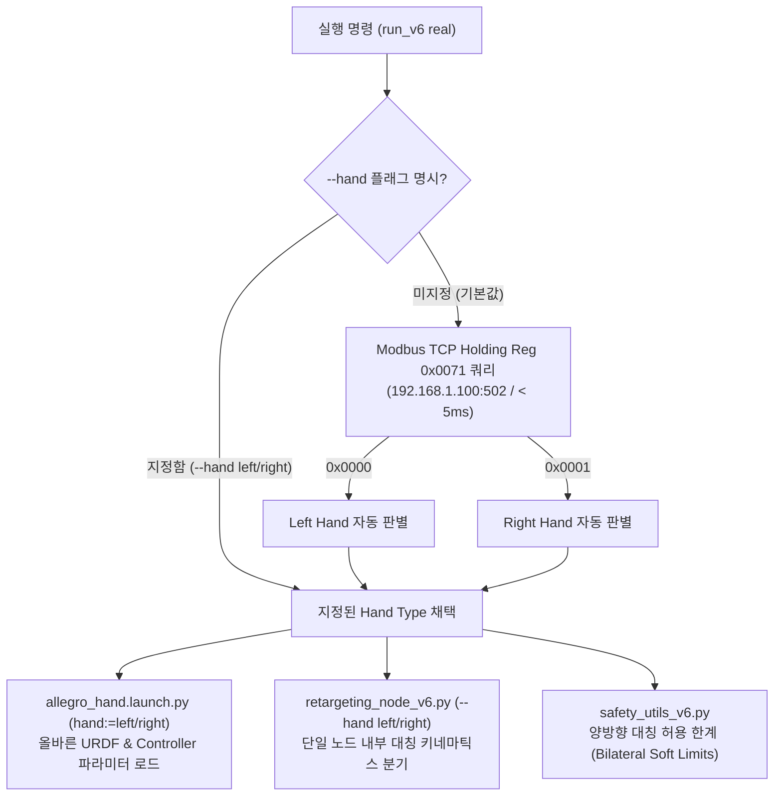
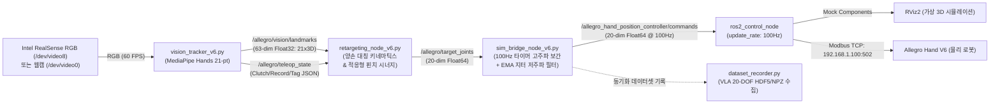

# Allegro Hand Vision Retargeting & Teleoperation System
> Wonik Robotics **Allegro Hand V6 (5-Finger, 20-DOF)** & **Allegro Hand V4 (4-Finger, 16-DOF)**  
> 양손(Left/Right) 통합 기구학 리타게팅, 실시간 비전 원격 제어, 하드웨어 텔레메트리 & VLA 데이터셋 수집 파이프라인

---

## 📑 목차 (Table of Contents)
1. [프로젝트 개요 (Overview)](#-프로젝트-개요-overview)
2. [💡 양손(Left/Right) 통합 아키텍처 및 원리 (인수인계 필독)](#-양손leftright-통합-아키텍처-및-원리-인수인계-필독)
3. [⚡ 원익 V6 펌웨어 토크/전류 시퀀스 (Firmware Protocol)](#-원익-v6-펌웨어-토크전류-시퀀스-firmware-protocol)
4. [🛠️ 하드웨어 자가진단 및 검증 도구 (Diagnostic Tools)](#️-하드웨어-자가진단-및-검증-도구-diagnostic-tools)
5. [📌 시스템 아키텍처 및 데이터 흐름 (Architecture & Dataflow)](#-시스템-아키텍처-및-데이터-흐름-architecture--dataflow)
6. [💻 설치 환경 및 Docker 재현 가이드 (Setup & Prerequisites)](#-설치-환경-및-docker-재현-가이드-setup--prerequisites)
7. [🚀 실행 가이드 (Quick Start)](#-실행-가이드-quick-start)
8. [⚙️ CLI 실행 옵션 상세 (Command-line Options)](#️-cli-실행-옵션-상세-command-line-options)
9. [🔍 트러블슈팅 가이드 (Troubleshooting)](#-트러블슈팅-가이드-troubleshooting)

---

## 📖 프로젝트 개요 (Overview)

본 레포지토리는 단일 RGB 카메라(Intel RealSense 또는 웹캠)와 MediaPipe Hands를 활용하여 작업자의 손동작을 실시간으로 추적하고, Wonik Robotics의 5지 로봇 의수/매니퓰레이터인 **Allegro Hand V6 (20자유도)** 및 4지 **Allegro Hand V4 (16자유도)**에 정밀하게 투영(Retargeting)하는 엔드투엔드 원격 제어(Teleoperation) ROS 2 패키지입니다.

### ✨ 핵심 기능 및 차별점
- **양손 통합 파이프라인 (Unified Bilateral Pipeline)**: 왼손/오른손 코드를 별도로 분리하지 않고, 하드웨어 레지스터 자동 감지 및 단일 노드 내부 부호 변환을 통해 완전 통합 관리.
- **엄지 4자유도 적응형 시너지 (Adaptive Thumb Grasp/Pinch Synergy)**: 외전(Opposition), 대립각, MCP/IP 굴곡의 비선형 가중치 매핑을 통해 정밀 핀치(Pinch) 및 파워 그립(Power Grasp) 구현.
- **60Hz / 100Hz 고주파 보간 및 지터 억제**: 카메라 FPS와 무관하게 제어 주기를 100Hz로 독립 구동하고 1차 IIR EMA 필터를 적용하여 모터 떨림(Tremor) 완전 박멸.
- **원터치 올인원 런처 (`run_v6`, `run_v4`)**: 호스트/도커 환경 자동 감지, 이더넷 네트워크 프리플라이트 점검, 하드웨어 모델 자동 판별, X11 GUI 포워딩 자동화.
- **PyQt5 통합 텔레옵 대시보드 & VLA 레코더**: 실시간 20관절 각도 게이지, 클러치(일시정지), 에피소드 녹화(R) 및 태그(S) 기능 내장.

---

## 💡 양손(Left/Right) 통합 아키텍처 및 원리 (인수인계 필독)

### Q. "왼손 버전과 오른손 버전 코드를 따로 분리해서 만들어야 하나요?"
> **답변: 절대 분리하지 않습니다 (NO). 단일 통합 파이프라인(Unified Pipeline)으로 유지해야 합니다.**
>
> 왼손과 오른손용으로 스크립트나 패키지를 복제(`allegro_left`, `allegro_right` 등)하면 이후 버그 수정, 제어 알고리즘 튜닝, 필터 파라미터 개선 시 매번 양쪽 코드를 수동 동기화해야 하며, 유지보수 비용과 인적 오류 위험이 기하급수적으로 증가합니다. 본 시스템은 아래와 같은 3단계 통합 설계로 양손을 완벽히 지원합니다.



### 1. 하드웨어 레벨 아이덴티티 (Modbus Register 0x0071)
Wonik Allegro Hand V6 내부 제어기(MCU) 비휘발성 메모리에는 손의 형상이 영구 기록되어 있습니다:
- **Holding Register `0x0071`**:
  - `0x0000` (0) : **Left Hand (왼손)**
  - `0x0001` (1) : **Right Hand (오른손)**
- **Holding Register `0x0318 ~ 0x031B` (8바이트 ASCII)**:
  - 시리얼 번호 (예: `P6LA0020` -> `LA`는 Left Allegro, `RA`는 Right Allegro)
- `run_teleop_v6.sh`는 `real` 모드 진입 시 소켓 통신을 통해 `0x0071` 레지스터를 5ms 내에 단발 조회하여 연결된 하드웨어 타입을 자동 식별합니다.

### 2. 기구학적 부호 대칭 원리 (Kinematic Sign Conventions)
Allegro Hand V6의 URDF(`allegro_hand_v6_left.urdf` vs `allegro_hand_v6_right.urdf`) 정의상:
- **검지/중지/약지/소지 (`joint10~43`)**:
  - 4개 손가락의 굴곡(Flexion) 좌표계는 양손이 동일하며, 주먹을 쥘 때 **항상 양수(`+`) 각도**로 굽혀집니다.
- **엄지손가락 (`joint00~03`) 의 기구학적 동작 원리**:
  - 오른손 URDF 엄지 회전축: `<axis xyz="0 0 1"/>`
  - 왼손 URDF 엄지 회전축: `<axis xyz="0 0 -1"/>`
  - **중요**: 원익 공식 URDF는 왼손 엄지 회전축을 이미 `-1`로 뒤집어 놓았기 때문에, **관절 가동 한계(Limit)는 오른손과 동일하게 양수(`0.0 ~ +1.40 rad`)가 전방 굴곡(Flexion) 방향**입니다!

| 관절 번호 | 기구학적 명칭 | 오른손 (Right Hand) 동작 | 왼손 (Left Hand) 동작 |
|---|---|---|---|
| **`joint00`** | Base Opposition / Abduction (손바닥 가로지름) | 외전/대립 시 **양수(`+0.05 ~ +1.40 rad`)** | 대립(손바닥/손가락 방향) 시 **음수(`-0.05 ~ -1.40 rad`)**<br/>*(양수 회전 시 손바닥 바깥쪽으로 벌어짐)* |
| **`joint01`** | Elevation / Inward Swing (전방 거상/스윙) | 손바닥 쪽 스윙 시 **음수(`-0.10 ~ -0.75 rad`)** | 손바닥 쪽 스윙 시 **양수(`+0.10 ~ +0.80 rad`)** |
| **`joint02`** | MCP Flexion (엄지 기저 관절 굽힘) | 굽힘(Flexion) 시 **양수(`0.0 ~ +1.20 rad`)** | 굽힘(Flexion) 시 **양수(`0.0 ~ +1.20 rad`)** |
| **`joint03`** | IP Flexion (엄지 끝마디 굽힘) | 굽힘(Flexion) 시 **양수(`0.0 ~ +1.30 rad`)** | 굽힘(Flexion) 시 **양수(`0.0 ~ +1.30 rad`)** |

> **왼손 엄지 회전 방향 및 뒤로 꺾임 현상 완벽 해결 내역**:
> 1. **기저 회전축(`joint00`) 손바닥 방향 보정**:
>    - 왼손 URDF는 회전축이 `[0, 0, -1]`로 정의되어 있어, 양수 각도로 회전하면 손바닥 뒤쪽/바깥쪽으로 돌아갑니다.
>    - `retargeting_node_v6.py`에서 왼손 모드 시 `q00_out = -float(q00)`으로 부호를 반전하여, 핀치/그랩/대립 동작 시 손가락들이 모이는 손바닥 안쪽(`-0.05 ~ -1.40 rad`)으로 정확히 회전하도록 보정 완료하였습니다.
>    - 아울러 `allegro_hand_v6_left.urdf`의 `joint00` 하한선(Limit)을 기존 `-0.035 rad`에서 `[-1.658 rad, +1.658 rad]`로 확장하여 시뮬레이션 및 제어기에서 음수 각도가 온전히 허용되도록 반영하였습니다.
> 2. **마디 굽힘(`joint02`, `joint03`) 과신전(Hyperextension) 해결**:
>    - `allegro_hand_v6_left.urdf`의 `joint02`, `joint03` 한계값은 `[-0.174 rad, +1.309 rad]`입니다.
>    - 이전 코드에서 축이 반대라는 이유로 `q02`, `q03`에 음수(`-`)를 곱해 `-0.8 rad`를 전달하면서 뒤로 꺾이는 현상이 발생했으나, 원익 URDF의 `-Z` 축 정의에 맞게 `q02`, `q03`을 양수(`+`)로 전달하도록 통일하여 **RViz와 실물 로봇 모두 자연스럽게 앞으로 굽혀지도록 완전 해결**되었습니다.

### 3. UI 실시간 양손 전환 및 RViz 3D 모델 즉시 갱신 (Live UI & RViz Sync)
- **콕핏 대시보드 (`teleop_dashboard_v6.py`)** 내에 **`HAND: [ ✋ LEFT HAND (왼손) ]` / `[ 🤚 RIGHT HAND (오른손) ]`** 상태 카드 및 원클릭 전환 버튼이 탑재되었습니다.
- 단축키 **`H` (Switch Hand)** 또는 버튼을 누르면:
  1. 리타게팅 노드의 키네마틱스 연산이 실시간으로 전환됩니다.
  2. **RViz2의 3D 로봇 손 모델(`/robot_description`)과 `robot_state_publisher`의 TF 좌표계가 재시작 없이 화면에서 즉시 왼손 ↔ 오른손으로 바뀝니다.**
- CLI 인자 `--hand left` 또는 `--hand right`를 통해 초기 상태를 지정할 수도 있습니다.

---

## ⚡ 원익 V6 펌웨어 토크/전류 시퀀스 (Firmware Protocol)

원익 로보틱스 Allegro Hand V6의 내장 펌웨어(`v3.0.0`, `0x0300`)는 독특한 안전 시퀀스를 요구합니다. 하드웨어 드라이버 개발 및 저수준 통신 시 아래 사항을 반드시 숙지해야 합니다:

1. **토크 ON 직후 목표 전류 초기화 방지**:
   - Modbus Coil `0x0000` (`TORQUE_ENABLE`)을 `1`로 쓰면, 내부 펌웨어가 안전을 위해 관절의 기본 목표 전류(`CMD_CUR`)를 **4~5mA (사실상 0A)** 수준으로 리셋합니다.
   - 따라서 토크를 켠 직후, 반드시 **Holding Register `0x0114 ~ 0x0127` (`CMD_CUR`)에 적정 구동 전류(200 ~ 250 mA)를 재인가**해야 관절 정지 마찰력(Stiction)을 극복하고 모터가 위치 목표값으로 부드럽게 기동합니다.
   - 본 패키지의 `ros2_control` 하드웨어 인터페이스와 진단 스크립트는 이 시퀀스를 자동으로 준수하도록 작성되었습니다.

---

## 🛠️ 하드웨어 자가진단 및 검증 도구 (Diagnostic Tools)

로봇 핸드가 정상 동작하지 않거나 비전 연동 전 하드웨어 단독 상태를 검증하고자 할 때 즉시 사용할 수 있는 도구들입니다.

### 1. 엄지 4관절 정밀 구동 및 텔레메트리 진단기 (`test_thumb.py`)
엄지 4개 관절(`joint00 ~ 03`)의 통신, 토크, 6단계 모션 궤적 추종 오차, 온도, 통신 에러를 1초 만에 검증합니다.

```bash
# 호스트 터미널에서 즉시 실행
python3 ~/test_thumb.py
# (또는 python3 /home/jake/humble_ws/allegro_vision_teleop/demo_thumb_poses.py)
```
- **검증 항목**:
  - `0x0000` (토크 활성화) 및 `0x0114` (200mA 정격 전류 인가)
  - 6단계 포즈 순회: `OPEN_HOME` -> `SWING_FORWARD` -> `TIP_CURL` -> `OPPOSITION_SWEEP` -> `DEEP_PINCH` -> `RETURN_HOME`
  - 추종 오차: 관절당 평균 **0.9° 미만**의 정밀 추종 확인
  - 텔레메트리 출력: 모터 오류 플래그(`0x0000`), 통신 실패 0건, 모터 온도(33~35°C 정상 범위)

### 2. 원익 로보틱스 공식 하드웨어 GUI (`run_v6_gui.sh`)
원익 로보틱스에서 제공하는 공식 PyQt 진단 GUI를 호스트 환경에서 즉시 구동합니다.

```bash
# 호스트 터미널에서 실행
~/run_v6_gui.sh
# (또는 /home/jake/humble_ws/allegro_vision_teleop/run_gui.sh)
```
- **주요 기능**:
  - 20개 관절별 실시간 위치/전류/온도 모니터링 그래프
  - 관절별 개별 P/I/D 게인 튜닝 및 플래시 메모리 저장
  - 데모 파지 모션(Grasp, Pinch, Spread) 원클릭 테스트
  - 비정상 과전류 셧다운 시 오류 코드 확인 및 리셋

---

## 📌 시스템 아키텍처 및 데이터 흐름 (Architecture & Dataflow)



---

## 💻 설치 환경 및 Docker 재현 가이드 (Setup & Prerequisites)

새로운 PC나 연구원에게 인수인계 시 그대로 복사하여 환경을 구축할 수 있는 절차입니다.

### 1. 하드웨어 및 이더넷 연결
- **전원**: 24V DC (정격 5A 이상) 파워서플라이 연결 후 로봇 전원 ON.
- **PC 유선 랜카드 IP 설정**:
  - IP: `192.168.1.10`
  - Subnet Mask: `255.255.255.0` (`/24`)
  - 로봇 핸드 기본 IP: `192.168.1.100` (Modbus TCP Port: `502`)
- **네트워크 핑 확인**:
  ```bash
  ping -c 2 192.168.1.100
  ```

### 2. Docker 컨테이너 생성 및 실행
본 시스템은 호스트의 드라이버 충돌을 방지하고 완벽한 재현성을 제공하기 위해 `ros_humble_dev` 컨테이너에서 동작합니다.

```bash
# 1. 호스트 X11 GUI 접근 허용
xhost +local:docker

# 2. 도커 컨테이너 생성 (최초 1회)
docker run -it -d \
  --name ros_humble_dev \
  --privileged \
  --net=host \
  -e DISPLAY=$DISPLAY \
  -v /tmp/.X11-unix:/tmp/.X11-unix:rw \
  -v /home/jake/humble_ws:/home/humble_ws:rw \
  osrf/ros:humble-desktop

# 3. 필수 의존성 일괄 설치 (컨테이너 내부)
docker exec -it ros_humble_dev bash -c "
  apt-get update && apt-get install -y \
    ros-humble-ros2-control \
    ros-humble-ros2-controllers \
    ros-humble-joint-state-broadcaster \
    ros-humble-position-controllers \
    ros-humble-rmw-cyclonedds-cpp \
    ros-humble-tf2-ros \
    ros-humble-rviz2 \
    v4l-utils can-utils python3-pip && \
  pip3 install mediapipe==0.10.14 opencv-python numpy scipy PyQt5 pymodbus
"
```

### 3. ROS 2 워크스페이스 빌드
```bash
docker exec -it ros_humble_dev bash -c "
  source /opt/ros/humble/setup.bash && \
  cd /home/humble_ws && \
  colcon build --symlink-install
"
```

---

## 🚀 실행 가이드 (Quick Start)

어디서든 간편하게 실행할 수 있도록 단축 런처가 홈 디렉토리에 등록되어 있습니다.

### 1. Allegro Hand V6 (5-Finger) 실행

#### ① 실제 하드웨어 로봇 제어 (Real Robot Teleoperation - 실전용)
```bash
~/run_v6.sh real
```
- **자동 동작**:
  1. 호스트 실행 감지 시 `ros_humble_dev` 컨테이너 자동 연결 및 GUI 포워딩.
  2. `192.168.1.100` 핑 사전 점검.
  3. Modbus `0x0071` 레지스터 조회를 통한 왼손/오른손 자동 판별.
  4. Intel RealSense RGB 카메라(`/dev/video8`) 자동 검색 및 60 FPS 연동.
  5. 100Hz 고주파 지터 억제 루프와 함께 PyQt5 콕핏 대시보드 구동.

> **특정 손 강제 지정 실행 시**:
> ```bash
> ~/run_v6.sh real --hand left   # 왼손 강제
> ~/run_v6.sh real --hand right  # 오른손 강제
> ```

#### ② 가상 3D 시뮬레이션 (RViz2 Simulation - 로봇 없이 테스트)
```bash
~/run_v6.sh sim
```
- 실제 로봇 전원을 켜지 않고도 웹캠이나 RealSense로 작업자의 손동작을 3D 가상 로봇 손이 정확하게 추종하는지 즉시 확인할 수 있습니다.

#### ③ VLA 로봇 학습용 데이터셋 동시 수집 모드
```bash
~/run_v6.sh real --record
```
- 카메라 영상, 21개 3D 랜드마크, 20-DOF 관절 지령/현재 위치를 HDF5/NPZ 포맷으로 동기화 기록합니다.
- 조작 키: `R` (에피소드 녹화 시작/정지), `S` (태스크 완료 플래그 태깅), `Space` (클러치 홀드).

---

### 2. Allegro Hand V4 (4-Finger, 16-DOF) 실행
```bash
# 실물 하드웨어 (SocketCAN can0 활성화 필요)
~/run_v4.sh real

# 시뮬레이션
~/run_v4.sh sim
```

---

## ⚙️ CLI 실행 옵션 상세 (Command-line Options)

`run_v6.sh [mode] [options]`에서 지원하는 유용한 파라미터입니다:

| 옵션 | 설명 | 기본값 | 사용 예시 |
|---|---|---|---|
| `real` / `sim` / `nodes` | 실행 모드 (물리 하드웨어 / RViz2 시뮬 / 비전 노드 단독) | `nodes` | `~/run_v6.sh real` |
| `--hand <left\|right>` | 로봇 손 모델 명시 (미지정 시 하드웨어 자동 감지) | `auto` (0x0071) | `--hand left` |
| `--rate <int>`, `--hz <int>` | 로봇 명령 송출 주기 (Hz) (100Hz 고주파 보간) | `100` | `--rate 100` |
| `--alpha <float>` | EMA 저주파 필터 계수 (작을수록 부드러움, 권장: 0.18~0.25) | `0.25` | `--alpha 0.20` |
| `--scale <float>` | 카메라 GUI 화면 배율 (마우스로 창 크기 조절도 가능) | `1.75` | `--scale 2.0` |
| `--fps <int>` | 카메라 캡처 목표 프레임레이트 | `60` | `--fps 60` |
| `--device <int>` | 카메라 디바이스 인덱스 (RealSense 없을 시 0으로 폴백) | `auto` | `--device 8` 또는 `--device 0` |
| `--record` | 20-DOF VLA 로봇 데이터셋 수집 노드 백그라운드 구동 | `false` | `--record` |
| `--no-gui` | GUI 창 없이 백그라운드(Headless) 실행 | `false` | `--no-gui` |

---

## 🔍 트러블슈팅 가이드 (Troubleshooting)

### Q1. "호스트에서 python3 teleop_dashboard_v6.py를 실행했더니 `ModuleNotFoundError: No module named 'mediapipe'` 에러가 납니다."
- **원인**: 본 패키지의 ROS 2 드라이버와 MediaPipe 환경은 **`ros_humble_dev` Docker 컨테이너 내부**에 완벽하게 빌드되어 있습니다. 호스트 머신의 기본 파이썬에는 패키지가 설치되어 있지 않아 발생하는 현상입니다.
- **해결책**:
  - 스크립트를 수동으로 직접 띄우지 마시고, 올인원 런처인 `~/run_v6.sh` (또는 `run_v6 real`)를 실행하십시오.
  - `run_v6.sh`는 호스트 터미널에서 실행되더라도 스스로를 감지하여 자동으로 `ros_humble_dev` 컨테이너 내부로 전환하고, X11 디스플레이를 호스트 모니터로 안전하게 포워딩하여 띄워줍니다.

### Q2. "엄지손가락이 안 움직이거나 엉뚱한 방향으로 버팁니다."
- **원인**:
  1. 연결된 로봇이 왼손인데 오른손 모드로 기동되었거나,
  2. 토크 온 직후 구동 전류(`0x0114`)가 0mA로 초기화된 경우입니다.
- **해결책**:
  1. `python3 ~/test_thumb.py`를 실행하여 엄지 4개 모터의 하드웨어 건전성을 확인합니다.
  2. `~/run_v6.sh real` 실행 시 터미널에 `[✓] Hardware auto-detected hand type: left hand` 로그가 출력되는지 확인합니다. 필요시 `--hand left` 옵션을 직접 주어 실행합니다.

### Q3. "RVIZ에서 로봇 손이 흩어져 보이고 조인트가 굳어 있습니다."
- **원인**: 로봇의 24V 전원이 꺼져 있거나 랜선이 연결되지 않아 `ros2_control_node`가 하드웨어 통신 타임아웃으로 중단된 상태입니다.
- **해결책**:
  1. 로봇 전원 박스 24V 스위치가 켜져 있는지 확인합니다.
  2. PC 유선 랜 설정이 `192.168.1.10/24`인지 확인합니다.
  3. 터미널에서 `ping 192.168.1.100`이 응답하는지 확인 후 `run_v6 real`을 재시작합니다.

### Q4. "RealSense 카메라가 켜지지 않거나 Device or resource busy 에러가 납니다."
- **원인**: 이전 실행 세션이 정상 종료되지 않아 비디오 노드(`/dev/video8`)를 이전 프로세스가 잡고 있는 경우입니다.
- **해결책**:
  - 컨테이너 내부의 잔여 프로세스를 깔끔히 정리합니다:
    ```bash
    docker exec ros_humble_dev pkill -9 -f "vision_tracker|retargeting|sim_bridge|teleop_dashboard"
    ```
  - 노트북 내장 카메라로 전환하여 테스트하려면 `--device 0` 옵션을 부여합니다:
    ```bash
    ~/run_v6.sh real --device 0
    ```

---

## 👥 인수인계 담당자 안내 (Handover Notice)
- **로봇 하드웨어 기종**: Wonik Robotics Allegro Hand V6 (Left Hand, S/N: `P6LA0020`, FW: `0x0300`)
- **핵심 소스코드 위치**:
  - `/home/jake/humble_ws/allegro_vision_teleop/` (ROS 2 패키지 및 텔레옵 알고리즘)
  - `/home/jake/humble_ws/src/allegro_hand_v6/` (원익 로보틱스 공식 드라이버 & C++ SDK)
- **심볼릭 링크 런처**:
  - `~/run_v6.sh` : V6 올인원 런처
  - `~/run_v6_gui.sh` : 원익 공식 하드웨어 GUI
  - `~/test_thumb.py` : 엄지 4관절 자가진단기
