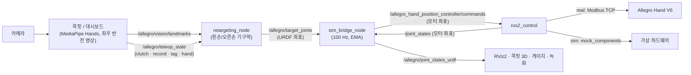

# Allegro Hand Vision Teleoperation

단일 RGB 카메라(웹캠 또는 Intel RealSense)와 MediaPipe Hands로 작업자의 손동작을 추적해 Wonik Robotics **Allegro Hand V6 (5지, 20-DOF)** 를 원격 조종합니다. 왼손/오른손 로봇을 모두 지원하고(기본은 오른손), VLA 학습용 데이터셋 녹화 기능이 들어 있습니다.

**ROS 2 Jazzy 네이티브(Ubuntu 24.04, 컨테이너 없음)** 가 기준입니다. 이전의 ROS 2 Humble + 도커 버전은 [`humble/`](humble/) 폴더에 동결해 두었습니다([Humble 버전과의 차이](#humble-버전과의-차이)).

| 기능 | 내용 |
|---|---|
| DexPilot 리타게팅 | 로봇 손끝 위치를 작업자 손끝에 맞추므로 **핀치가 실제로 닫힘** (패드 간격 129 mm → 6 mm) |
| 압력센서 화면 | 18채널 접촉 압력(kPa)을 V6 손바닥 위에 표시 |
| 떨림 대응 | 좌표 중앙값 + EMA, 추적이 끊기면 리타게팅 초기화 |
| 로봇 자동 탐색 | 후보 주소를 확인해 알레그로 핸드인지 검증하고, 기본 손(오른손)을 우선 선택 |

---

## 목차
1. [환경 설정](#환경-설정)
2. [빠른 실행](#빠른-실행) (압력센서 화면, 떨림 대응 포함)
3. [v2 리타게팅 (핀칭)](#v2-리타게팅-핀칭)
4. [시스템 구조](#시스템-구조)
5. [왼손/오른손 처리](#왼손오른손-처리)
6. [실행 옵션](#실행-옵션)
7. [단축키](#단축키)
8. [데이터셋 녹화](#데이터셋-녹화)
9. [설정 파일](#설정-파일)
10. [Humble 버전과의 차이](#humble-버전과의-차이)
11. [트러블슈팅](#트러블슈팅)

---

## 환경 설정

처음 설치하는 PC 기준으로, 아래 순서대로 한 번만 하면 됩니다.

| 항목 | 요구 사항 |
|---|---|
| OS / ROS | Ubuntu 24.04 · ROS 2 **Jazzy** (apt 설치, 컨테이너 없음) |
| Python | 시스템 `python3` 3.12. 이 저장소용 `.venv` 와 리타게팅용 `.venv` 를 따로 씁니다(아래 3, 4단계) |
| 로봇 통신 | Modbus TCP, 로봇 기본 주소 `192.168.1.100:502`. PC 유선 랜을 같은 서브넷의 **다른** 주소로 설정 |
| 카메라 | `/dev/video*` 자동 감지 (RealSense RGB 우선, 없으면 실제로 캡처되는 첫 장치) |
| GPU | 없어도 동작. NVIDIA dGPU가 있으면 콕핏 3D 뷰만 GPU로 렌더링 |

### 1. ROS 2 Jazzy

[ROS 2 Jazzy 설치 문서](https://docs.ros.org/en/jazzy/Installation/Ubuntu-Install-Debs.html)대로 `ros-jazzy-desktop` 을 설치합니다. 나머지 apt 패키지는 4단계의 `tools/setup.sh` 가 설치합니다.

### 2. 원익 V6 드라이버 작업공간

원익 로보틱스의 Allegro Hand V6 ROS 2 패키지(`allegro_hand_v6_bringup`, `_description`, `_hardware` 와 그 의존 패키지)를 colcon 워크스페이스에 두고 빌드합니다. **드라이버 패키지는 수정하지 않습니다.** 이 저장소의 `launch/allegro_hand_bringup.launch.py` 가 필요한 차이를 대신 처리합니다.

```bash
mkdir -p ~/v6f_manuse_teleoperation/src
# 원익 드라이버 패키지를 ~/v6f_manuse_teleoperation/src 아래에 둔다
cd ~/v6f_manuse_teleoperation
rosdep install --from-paths src --ignore-src -y
colcon build --symlink-install --base-paths src
```

빌드가 실패하면 다음을 확인합니다.

- **`--base-paths src`**: 3단계의 `V6_Teleoperation` 을 이 워크스페이스 안에 두면, 이 옵션 없이는 colcon이 그 안의 URDF 내보내기 패키지(`V6_Force_R` 등)까지 빌드하려다 실패합니다.
- **conda / miniforge**: `No module named 'catkin_pkg'` 가 나오고 오류에 conda 파이썬 경로가 보이면, CMake가 시스템 파이썬 대신 conda 파이썬을 잡은 것입니다. `conda deactivate` 를 하고 `VIRTUAL_ENV` 도 비운 셸에서 `build/` `install/` `log/` 를 지우고 다시 빌드합니다.
- **빠진 파일**: 드라이버 소스를 git으로 받으면 빈 `allegro_hand_v6_description/usd/` 폴더가 빠져 설치 단계가 실패합니다(`mkdir` 로 만들면 됩니다). RViz에 `Could not load resource …/Finger01_Link01.STL` 이 뜨면 `meshes/` 에 `Finger0X_Link0Y.STL`, `Palm.STL` 이 있는지 확인합니다.

워크스페이스 위치가 다르면 `config/teleop.env` 의 `ALLEGRO_WS` 를 바꿉니다.

저장소의 `urdf/` 는 콕핏 3D 뷰가 쓰는 사본이라 드라이버 패키지의 URDF와 같아야 합니다. 드라이버를 새 버전으로 바꾸면 `cp <드라이버>/allegro_hand_v6_description/urdf/allegro_hand_v6_{right,left}.urdf urdf/` 로 같이 맞추세요.

**왼손 벌림 관절은 예외입니다.** `joint10/20/30/40` 은 드라이버 패키지와 축 부호가 반대이고, 그게 실물이 보고하는 부호입니다. 2026-10-08 에 손가락을 손으로 벌려 엔코더를 읽어 확인했습니다(명령은 보내지 않음). 검지가 +1.39 rad 까지 가는데 드라이버 URDF 는 그 방향으로 +0.38 rad 까지만 허용합니다. 즉 이 왼손은 오른손과 같은 부호를 쓰고, 드라이버 URDF 의 좌우 대칭 기술과 맞지 않습니다. 왼손 펌웨어가 `0x0103`, 오른손이 `0x0300` 이라 펌웨어 세대 차이일 수 있습니다. 드라이버를 새로 받아도 이 네 관절은 덮어쓰지 마세요 (파일 맨 위에 같은 설명이 있습니다). 원익에 확인 후 공식 URDF 가 고쳐지면 이 예외는 지우면 됩니다.

그래서 `launch/allegro_hand_bringup.launch.py` 는 `urdf/allegro_hand.urdf.xacro` 를 씁니다. 드라이버 bring-up xacro 와 같은데 손 모델만 이 저장소 `urdf/` 에서 읽고, `ros2_control` 블록은 드라이버 것을 그대로 include 합니다. 덕분에 RViz·컨트롤러·콕핏이 모두 같은 URDF 를 보고, 드라이버 패키지는 수정하지 않습니다.

### 3. DexPilot 리타게팅 코어 (사내 MANUS 텔레옵 프로젝트)

v2/v3 리타게팅은 사내 MANUS 텔레옵 프로젝트(`V6_Teleoperation`)의 리타게팅 코어, 튜닝된 설정, 손끝 패드 오프셋을 **복사하지 않고 그 경로에서 그대로 읽습니다.** 이 프로젝트는 별도로 받아야 합니다. DexPilot이 numpy 2.x를 쓰기 때문에 이 저장소의 `.venv`(numpy 1.x, mediapipe용)와 분리된 가상환경에서 돌립니다.

```bash
cd <V6_Teleoperation 위치>
python3.12 -m venv .venv
.venv/bin/pip install --upgrade pip
.venv/bin/pip install -e .          # dex_retargeting, pinocchio 등. GeoRT 학습까지 쓰려면 -e ".[train]"
```

위치를 `config/teleop_v2.env` 에 적습니다.

| 변수 | 의미 | 기본값 |
|---|---|---|
| `V6F_TELEOP_ROOT` | `V6_Teleoperation` 위치 | `~/v6f_manuse_teleoperation/V6_Teleoperation` |
| `RETARGET_PY` | 리타게팅 노드를 돌릴 파이썬 | `$V6F_TELEOP_ROOT/.venv/bin/python` |

### 4. 이 저장소

```bash
git clone https://github.com/jacoblee1214/allegro_vision_teleop.git
cd allegro_vision_teleop
./tools/setup.sh              # apt 패키지(sudo) + .venv + meshes 링크 + 검증
```

`tools/setup.sh` 가 하는 일:

1. **apt**: `ros-jazzy-ros2-control`, `ros-jazzy-ros2-controllers`, `ros-jazzy-rviz2`, `ros-jazzy-xacro`, `ros-jazzy-robot-state-publisher`, `ros-jazzy-cv-bridge`, `ros-jazzy-rmw-cyclonedds-cpp`, `python3-pyqt5`, `v4l-utils` 등
2. **`.venv`** (`--system-site-packages`): `mediapipe`, `opencv-contrib-python`, `PyOpenGL`, `scipy` 를 pip로 설치. `rclpy` · `cv_bridge` · `PyQt5` 는 apt 것을 그대로 씁니다.
3. **`meshes` 심볼릭 링크**: 드라이버 패키지의 STL 메쉬 → 콕핏 3D 뷰가 워크스페이스를 source 하지 않아도 동작 (왼손은 `meshes/left/` 를 따로 쓰므로 드라이버 소스에 이 폴더가 있어야 합니다)
4. **검증**: 드라이버 패키지 탐색 여부와 모든 파이썬 의존성 import 확인

sudo 없이 돌리려면 `./tools/setup.sh --no-apt` (apt 패키지가 이미 깔려 있을 때). 저장소 위치는 자유입니다.

> **numpy는 1.26.4로 고정입니다.** mediapipe 0.10.x는 numpy 2.x에서 동작하지 않고, pip numpy 2.x를 ROS 2 프로세스에 섞으면 `rclpy` C 확장이 깨집니다. 3단계의 리타게팅용 가상환경을 따로 두는 이유입니다.

### 5. 네트워크와 동작 확인

PC 유선 랜을 로봇과 같은 서브넷으로 설정합니다(예: `192.168.1.10/24`). 인터페이스 이름과 PC 주소는 `config/teleop.env` 의 `ETH_IFACE`, `PC_IP` 입니다. **PC에 로봇 주소(`192.168.1.100`)를 주면 안 됩니다.** PC가 자기 자신에게 응답해서 로봇이 연결된 것처럼 보입니다.

```bash
./check_hand.sh               # ROS 없이 통신·손 종류·엔코더 확인
./run_dashboard_v3.sh sim     # 로봇 없이 UI와 리타게팅 확인
./run_dashboard_v3.sh         # 실물
```

---

## 빠른 실행

평소에는 **이 명령 하나**면 됩니다. 대시보드 + RViz2 + 압력센서 화면 + DexPilot 리타게팅으로 실물 손을 띄웁니다.

```bash
./run_dashboard_v3.sh
```

필요할 때만 덧붙입니다.

```bash
./run_dashboard_v3.sh --hand right    # 왼손·오른손이 둘 다 연결돼 있을 때 오른손을 고른다
./run_dashboard_v3.sh --smooth 9      # 로봇이 떨면 평활화를 키운다
./run_dashboard_v3.sh sim --hand left # 로봇 없이 확인
./check_hand.sh                       # 통신·손 종류·엔코더 확인 (ROS·venv 불필요)
```

- **로봇 주소는 자동으로 찾습니다.** 기본 주소(`config/teleop.env` 의 `HAND_IP`)와 런처에 적힌 후보 주소를 차례로 확인하고, 응답한 장비가 실제 알레그로 핸드인지(펌웨어·손 종류 레지스터)까지 검증합니다. `--hand` 를 주면 그 손이라고 응답한 장비를 고릅니다. 다른 주소면 `--ip` 로 지정합니다.
- 알레그로 핸드는 **접속을 하나만 허용**합니다. 다른 세션이 그 손에 붙어 있으면 탐색에서 보이지 않으니 먼저 종료하세요.
- 로그의 `[OK] Allegro Hand found: ... (right hand, ...)` 줄로 손 종류를 확인하세요. **왼손 로봇을 오른손 모드로 구동하면 손가락이 90° 굽혀집니다.**
- 종료는 런처를 실행한 터미널에서 `Ctrl+C`.

### 압력센서 화면 (v3)

V6의 18개 압력센서(손가락마다 3개, 손바닥 3개)를 V6 손바닥 렌더 위에 표시합니다. 원익 `allegro_hand_sensor_visualizer`(손가락 4개 손용)를 참고해 검은 배경, 손 이미지, 원익 로고로 구성했습니다.

- 값은 **접촉 압력(kPa)** 입니다. 센서는 대기압(약 1013~1024 hPa, 센서마다 조금 다름)을 읽으므로, 시작할 때 손에 아무것도 닿지 않은 상태의 값을 기준으로 뺍니다. 다시 잡으려면 **T**.
- 색은 0~40 kPa 구간입니다(세게 누르면 약 50 kPa).
- 500 hPa 아래로 읽히는 채널은 **신호 없음(회색 `--`)** 으로 표시합니다. 센서나 배선에 문제가 있는 채널입니다.
- 센서 배치는 오른손 실물에서 패드를 하나씩 눌러 실측했습니다(2026-10-08). 손가락마다 **손끝 → 가운데 마디 → 뿌리 쪽 마디** 순서(엄지 0~2, 검지 3~5, 중지 6~8, 약지 9~11, 소지 12~14)이고, 손바닥은 15 = 위쪽 검지 쪽 패드, 16 = 위쪽 소지 쪽 패드, 17 = 아래쪽 패드입니다. 왼손은 같은 배치를 좌우 반전해 씁니다(왼손은 따로 눌러 보지 않음). 이 오른손은 14번(소지 뿌리 쪽 마디)이 0을 읽습니다. **N** 을 누르면 채널 번호가 표시되고, 좌표는 `assets/v6_tactile_layout.json` 에 있습니다.
- 토픽은 자동으로 찾습니다(이름이 `tactile_pressures` 로 끝나는 토픽). 지정하려면 `--tactile-topic`.

### 떨림 대응 (v3)

손끝 거리를 맞추는 방식은 MediaPipe 좌표의 프레임별 노이즈에 민감해서, 그대로 두면 로봇이 떱니다. v3 리타게팅 노드는 좌표를 DexPilot에 넣기 전에 **중앙값(기본 5프레임) + EMA(기본 0.3)** 로 거릅니다. 손을 멈춘 구간에서 측정한 떨림이 13.8 → 5.9 mrad/프레임으로 줄었습니다(입력 노이즈 3 mm 기준). 추적이 0.3초 이상 끊기면 DexPilot의 이전 해도 버립니다.

| 상황 | 옵션 |
|---|---|
| 아직 떤다 | `--smooth 9 --ema 0.2` |
| 반응이 굼뜨다 | `--smooth 3 --ema 0.5` 또는 `--retarget-alpha 0.6` |

### 이전 버전 명령

```bash
./run_dashboard.sh                   # run_dashboard_v3.sh 와 같음 (항상 최신 버전을 띄움)
./run_dashboard.sh --v2              # v2: DexPilot, 압력 화면·평활화 없음
./run_cockpit_v2.sh real             # 콕핏 UI + DexPilot 리타게팅
./run_cockpit.sh real                # 콕핏 UI (v1 리타게팅)
./run_teleop.sh real --cockpit --record   # 콕핏 + 데이터셋 녹화
```

**ROS 2 Humble (도커 `ros_humble_dev`) 구버전**은 [`humble/README.md`](humble/README.md) 를 보세요. 예: `~/humble_ws/allegro_vision_teleop/humble/run_dashboard_v6_1.sh real`

---

## v2 리타게팅 (핀칭)

v1(`retargeting_node.py`)은 MediaPipe 뼈대 각도를 게인·보간표로 관절값에 옮기는
기하 매핑이라, 로봇 지문이 실제로 어디 놓이는지는 확인하지 않습니다. 그래서
화면에서는 핀칭 자세가 나와도 실물에서는 집히지 않고, **엄지가 안쪽으로 덜
굽혀집니다**(엄지 `joint01`이 −0.65 rad에서 막힘, 핀치에 필요한 값은 −1.0 rad).

v2는 MANUS 텔레옵 프로젝트(`~/v6f_manuse_teleoperation/V6_Teleoperation`)의
DexPilot 리타게팅을 그대로 가져다 씁니다. 매 프레임 최적화로 로봇 지문을 작업자
지문 위치에 맞춥니다. 참조하는 URDF는 이 저장소의 `urdf/allegro_hand_v6_right.urdf`와
바이트 단위로 동일합니다 — URDF가 틀린 게 아니라 v1 매핑이 그 범위를 안 쓰고
있었습니다.

작업자 지문이 2.2 mm까지 붙은 프레임에서 로봇 지문 사이 거리 (`tools/check_pinch_v2.py`):

| | v1 (기하 매핑) | v2 (DexPilot) |
|---|---|---|
| 엄지–검지 지문 거리 | **129 mm** | **6 mm** |
| 엄지 `joint01` | −0.40 rad | −1.01 rad |

2026-09-30 실물 V6 핸드에서 확인했습니다.

```bash
./run_dashboard.sh real --v2  # 대시보드 + RViz2 + DexPilot (v2. 옵션 없이 실행하면 최신 v3)
./run_cockpit_v2.sh real      # 콕핏 + DexPilot
./run_teleop_v2.sh sim --hand right
./run_dashboard.sh real --v1  # 대시보드를 예전 기하 매핑으로 되돌리고 싶을 때

./run_dashboard.sh real --retarget-alpha 0.6   # 반응 속도 ↑ (지연 100→22 ms)
```

**반응이 굼뜨면 `--retarget-alpha`부터 올리세요.** DexPilot 출력 필터가 전체 지연
(~190 ms)의 절반을 차지합니다. 갱신 주기는 카메라가 천장이고 이 노트북 웹캠은
모든 포맷에서 30 fps가 최대라 `--fps 60`은 효과가 없습니다 — 측정값과 나머지
조정 방법은 [`docs/dexpilot_retargeting_v2.md`의 제어 속도 / 지연](docs/dexpilot_retargeting_v2.md#제어-속도--지연)에 있습니다.

**`run_dashboard.sh`는 항상 최신 버전을 띄웁니다(현재 v3, `--v2`·`--v1` 로 이전 버전).** `run_cockpit.sh`와 `run_teleop.sh`는
일부러 v1 그대로 두었고, v2로 돌리려면 `run_cockpit_v2.sh` / `run_teleop_v2.sh`를
쓰면 됩니다. v1 노드와 스크립트는 전부 남아 있습니다. 자세한 내용(월드
랜드마크 토픽, 스케일 측정, 좌우 반전, 인터프리터가 둘인 이유, 추가된 파일 목록)은
[`docs/dexpilot_retargeting_v2.md`](docs/dexpilot_retargeting_v2.md)에 있습니다.

---

## 시스템 구조


```mermaid
flowchart LR
    CAM["카메라"] --> UI["콕핏 / 대시보드<br/>(MediaPipe Hands, 좌우 반전 영상)"]
    UI -->|"/allegro/vision/landmarks"| RT["retargeting_node<br/>(왼손/오른손 기구학)"]
    UI -->|"/allegro/teleop_state<br/>(clutch · record · tag · hand)"| RT
    RT -->|"/allegro/target_joints<br/>(URDF 좌표)"| BR["sim_bridge_node<br/>(100 Hz, EMA)"]
    BR -->|"/allegro_hand_position_controller/commands<br/>(모터 좌표)"| CM["ros2_control"]
    CM -->|"real: Modbus TCP"| HW["Allegro Hand V6"]
    CM -->|"sim: mock_components"| MOCK["가상 하드웨어"]
    CM -->|"/joint_states (모터 좌표)"| BR
    BR -->|"/allegro/joint_states_urdf"| VIEW["RViz2 · 콕핏 3D · 게이지 · 녹화"]
```

| 파일 | 역할 |
|---|---|
| `run_teleop.sh` | 통합 런처 (환경 source, 카메라·손 종류 감지, 노드 기동, 종료 정리) |
| `run_cockpit.sh` | 콕핏 런처 (v1 리타게팅) |
| `run_dashboard.sh` | 대시보드 런처. **항상 최신 버전(현재 v3: 압력 화면 포함)으로 실행**, `--v2`·`--v1`로 이전 동작 |
| `run_teleop_v2.sh`, `run_cockpit_v2.sh`, `run_dashboard_v2.sh` | v2 런처 ([v2 리타게팅](#v2-리타게팅-핀칭)) |
| `launch/allegro_hand_bringup.launch.py` | ros2_control 브링업 (드라이버 패키지를 건드리지 않음) |
| `config/teleop.env` | 이 PC의 기본값 (워크스페이스·IP·인터페이스·기본 옵션) |
| `teleop_cockpit.py` | 콕핏 UI (카메라 + MediaPipe + OpenGL 3D 뷰) |
| `teleop_dashboard.py` | 대시보드 UI (RViz2와 함께 사용) |
| `retargeting_node.py` | 랜드마크 → 20관절 목표각 (왼손/오른손 별도 파이프라인) |
| `sim_bridge_node.py` | 100 Hz 명령 송출, EMA 필터, URDF ↔ 모터 좌표 변환 |
| `vision_tracker.py` | 헤드리스/단순 GUI 모드의 MediaPipe 노드 |
| `dataset_recorder.py` | 에피소드 녹화 |
| `safety_utils.py` | 관절 순서·한계 정의 |
| `tools/setup.sh` | 설치 스크립트 |
| `tools/check_hand.py`, `check_hand.sh` | 로봇 통신 진단 (표준 라이브러리만 사용) |
| `tools/detect_camera.py` | 카메라 자동 선택 (RealSense 우선, 흑백 전용 IR 노드 제외) |
| `urdf/` | `allegro_hand_v6_{left,right}.urdf` 사본 (드라이버 패키지와 동일) |

---

## 왼손/오른손 처리

- **손 감지**: `real` 모드에서 Modbus 레지스터 `0x0071`을 읽어 판별하고, 그 값을 리타게팅·브릿지·UI·launch에 똑같이 전달합니다.
- **조종 손**: 로봇 왼손은 작업자 왼손으로, 오른손은 오른손으로 조종합니다. 반대 손을 쓰면 굽힘이 인식되지 않습니다.
- **리타게팅**: 왼손/오른손 파이프라인은 거울 대칭입니다. 굽힘은 같은 값, 벌림은 부호 반대. 엄지는 손별로 따로 튜닝되어 있습니다.
- **URDF 좌표계**: 모든 관절이 0 rad에서 손가락이 곧게 펴지고, 양수가 손바닥 쪽 굽힘입니다.
- **왼손 MCP 모터 영점**: 왼손의 MCP 모터(`joint11/21/31/41`)는 손가락을 편 상태에서 **0을 읽습니다**(URDF 그대로). 보정이 필요 없어 기본값은 보정 없음입니다. 영점이 90° 틀어진 손을 만나면 `--left-mcp-offset -1.5708` 로 켜고, 변환은 `sim_bridge_node.py` 한 곳에서만 합니다. 확인 방법: 텔레옵을 끄고 손가락을 편 상태에서 `./tools/check_hand.py 100` 의 값을 읽으면 그 값이 곧 오프셋입니다. (2026-10-08 실측: 힘을 푼 왼손이 joint11 = +1.42 rad 로 굽힘이 양수. 9월에는 −π/2 였는데 그 뒤 영점을 다시 잡은 것으로 보입니다.)

| 경로 | 변환 (real + 왼손, joint11/21/31/41) |
|---|---|
| 명령: `/allegro/target_joints` → 컨트롤러 | −π/2 |
| 피드백: `/joint_states` → `/allegro/joint_states_urdf` | +π/2 |

RViz2, 콕핏 3D 뷰, 게이지, 녹화는 모두 `/allegro/joint_states_urdf`를 구독하므로 화면과 데이터는 항상 URDF 좌표계입니다. `sim` 모드와 오른손은 변환 없이 통과합니다.

---

## 실행 옵션

`./run_teleop.sh [nodes|sim|real] [options]` (`run_cockpit.sh`, `run_dashboard.sh`,
`run_teleop_v2.sh` 계열도 같은 옵션. v2 런처는 DexPilot 전용 옵션이 몇 개 더
있습니다 — `--help` 참고)

| 옵션 | 설명 | 기본값 |
|---|---|---|
| `real` / `sim` / `nodes` | 실물 로봇 / mock 하드웨어 / 텔레옵 노드만 | `nodes` |
| `--cockpit`, `--3d` | 콕핏 UI (창 하나, 3D 손 내장) | `config/teleop.env`의 `UI_MODE` (기본 `cockpit`) |
| `--classic`, `--dashboard` | 대시보드 + RViz2 | |
| `--simple-gui` | MediaPipe OpenCV 창만 | |
| `--no-gui`, `--headless` | GUI 없이 실행 | |
| `--rviz` / `--no-rviz` | RViz2 창 강제 on/off | UI에 따라 자동 |
| `--hand left\|right` | 손 종류 지정 (`real`은 자동 감지) | `right` |
| `--ip <주소>` | 로봇 IP (`101` 또는 `192.168.1.101`) | `config/teleop.env`의 `HAND_IP`, 실패 시 후보 탐색 |
| `--descriptor <str>` | io interface descriptor 직접 지정 | `modbus_tcp:$HAND_IP:$HAND_PORT` |
| `--rate`, `--hz <Hz>` | 로봇 명령 송출 주기 | `100` |
| `--alpha <0~1>` | EMA 필터 계수 (작을수록 부드럽고 느림) | `0.25` |
| `--fps <int>` | 카메라 캡처 FPS | `60` |
| `--device <int>` | 카메라 장치 번호 | 자동 감지 |
| `--scale <float>` | `--simple-gui` 창 배율 | `1.75` |
| `--record` | 데이터셋 녹화 노드 실행 | 꺼짐 |

---

## 단축키

**콕핏 또는 대시보드 창이 포커스를 가진 상태**에서 눌러야 합니다. RViz2 창이나 터미널을 클릭한 상태에서는 그쪽으로 키가 가므로 동작하지 않습니다. 모든 기능에는 같은 동작을 하는 화면 버튼도 있습니다.

| 키 | 기능 |
|---|---|
| `C` | 클러치: 추적을 일시정지하고 로봇을 현재 자세로 유지 |
| `R` | 에피소드 녹화 시작/중지 (**`--record`로 실행해야 실제로 저장됩니다**) |
| `S` / `F` | 녹화한 에피소드를 성공 / 실패로 태그해 저장 |
| `H` | 손 모델 전환 (`sim`·`nodes` 전용. `real`은 실물이 고정이라 비활성) |
| `Q` / `Esc` | UI 종료 |

`--record` 없이 실행하면 `R`을 눌러도 UI 배지만 바뀌고 저장되는 파일은 없습니다. 녹화까지 하려면 `./run_teleop.sh real --cockpit --record`로 실행하세요.

- 콕핏 3D 뷰: 좌클릭 드래그 회전, 우클릭 드래그 이동, 휠 확대/축소, 더블클릭으로 기본 시점 복귀.
- 3D 뷰에서 엄지·검지 끝이 노랗게 변하는 것은 핀치 표시입니다. 로봇 제어와는 무관합니다.

### RViz2 뷰 조작 (`--classic` / `run_dashboard.sh`)

RViz2의 기본 Orbit 카메라입니다. 조작 전에 RViz2 창을 한 번 클릭하세요.

| 조작 | 동작 |
|---|---|
| 좌클릭 드래그 | 대상 중심으로 회전 (orbit) |
| 휠 스크롤 / 우클릭 드래그 위아래 | 확대/축소 |
| 휠 클릭 드래그 (또는 `Shift` + 좌클릭 드래그) | 평행 이동 (pan) |
| 상단 `Focus Camera` 툴 + 손 클릭 | 클릭한 지점을 회전 중심으로 |
| 좌측 `Views` 패널 → `Zero` 버튼 | 시점 초기화 |

손이 안 보이면 좌측 `Displays` → `Global Options` → `Fixed Frame`이 `world`인지, `RobotModel`·`TF` 체크가 켜져 있는지 확인하세요.

---

## 데이터셋 녹화

`--record`로 실행하고 `R`로 녹화, `S`/`F`로 태그합니다.

- 저장 위치: `<저장소>/data/episodes/` (`config/teleop.env`의 `AVT_EPISODE_DIR` 또는 `--output-dir`로 변경)
- 형식: 에피소드별 JSON 파일 + `manifest.json`
- 기록 항목: 관절 목표각(action), 실제 관절 상태(state), MediaPipe 3D 랜드마크, 클러치 상태. state와 action 모두 URDF 좌표계.

`data/`는 `.gitignore`에 들어 있습니다.

---

## 설정 파일

`config/teleop.env`가 이 PC의 기본값을 담고 있고, 런처가 시작할 때 source 합니다. 우선순위는 **명령행 플래그 > 환경변수 > 이 파일**입니다.

| 변수 | 의미 |
|---|---|
| `ALLEGRO_WS` | 드라이버 패키지 colcon 워크스페이스 (`~/v6f_manuse_teleoperation`) |
| `ROS_SETUP` | ROS 2 setup 스크립트 (`/opt/ros/jazzy/setup.bash`) |
| `HAND_IP`, `HAND_PORT`, `HAND_ID` | 로봇 Modbus TCP 주소·포트·슬레이브 id |
| `ETH_IFACE`, `PC_IP` | 로봇과 연결된 유선 인터페이스와 PC 주소 |
| `HAND_SIDE`, `UI_MODE`, `RATE`, `ALPHA`, `FPS`, `SCALE`, `DEVICE` | 텔레옵 기본값 |
| `AVT_EPISODE_DIR` | 녹화 저장 위치 (비우면 `<저장소>/data/episodes`) |

파이썬 노드는 `AVT_URDF_DIR`, `AVT_MESH_DIR`로 URDF·메쉬 경로를 덮어쓸 수 있습니다. 지정하지 않으면 `저장소/urdf` → `저장소/meshes` → 드라이버 패키지 share 순으로 찾습니다.

---

## Humble 버전과의 차이

| 항목 | Humble 버전 (`humble/`, 도커) | Jazzy 버전 (저장소 루트, 네이티브) |
|---|---|---|
| 실행 위치 | 런처가 `ros_humble_dev` 컨테이너로 자동 진입, 경로 `/home/humble_ws/allegro_vision_teleop` 고정 | 컨테이너 없음. 저장소 위치 자유, 스크립트 위치 기준으로 동작 |
| 파일 이름 | `*_v6`, `*_v6_1`, `*_v6_2`, `*_v6_3` 버전 파일 병존 | 최신 버전(`v6_3` 계열)만 남기고 접미사 제거 |
| 드라이버 패치 | `wonik_patch_v6_1/`을 Wonik bringup 패키지에 복사해 재빌드 | 복사 없음. `launch/allegro_hand_bringup.launch.py`가 같은 역할을 저장소 안에서 수행 |
| 파이썬 환경 | 컨테이너에 pip 전역 설치 | `.venv` (`--system-site-packages`), numpy 1.26.4 고정 |
| OpenGL | `LIBGL_ALWAYS_SOFTWARE=1` 전역 + 콕핏만 PRIME | 전역 소프트웨어 렌더링 없음(Mesa 사용 가능). 콕핏만 PRIME 오프로드 |
| rmw | CycloneDDS 강제 | 설치되어 있으면 CycloneDDS, 없으면 기본 rmw로 진행 |
| 하드코딩 경로 | `/home/humble_ws`, `~/humble_ws` | 전부 `config/teleop.env` + 스크립트 상대 경로 |
| 녹화 경로 | `/home/humble_ws/pinn_hw/results/episodes` | `<저장소>/data/episodes` |
| V4 (4지) 지원 | `run_v4.sh` 포함 | 제외 (이 PC는 V6 5지 하드웨어) |

`launch/allegro_hand_bringup.launch.py`는 `allegro_hand_v6_bringup`의 원본 launch와 비교해 이렇게 다릅니다.

- `rviz` 인자가 실제로 RViz2를 켜고 끕니다 (콕핏은 자체 3D 뷰가 있어서 필요 없음).
- `joint_states_topic`으로 `robot_state_publisher`가 `/allegro/joint_states_urdf`를 읽게 합니다. 왼손 MCP 영점 보정을 켠 경우 이 토픽이 그 보정을 되돌려 줍니다.
- 촉각 릴레이 / 대시보드 / 포즈 GUI 노드는 띄우지 않습니다 (MANUS 데모용).
- 컨트롤러 spawner 타임아웃을 60초로 늘렸습니다. Modbus 하드웨어 초기화가 ~9초 걸려서 기본 10초로는 콜드 스타트 때 `joint_state_broadcaster`가 실패합니다.
- `world → base_link` 정적 변환이 항등입니다. Wonik 브링업은 `pitch = -π/2`를 써서 손가락이 눕고 엄지만 위를 향하는데, `base_link`에서 +Z가 손가락 방향이라 항등 회전이어야 RViz에서 손이 선 자세로 보입니다.

> 기본은 **오른손**입니다(`config/teleop.env` 의 `HAND_SIDE`). 두 손이 다 연결돼 있으면 오른손을 고르고, 오른손이 없으면 연결된 손을 씁니다. 왼손 코드 경로도 그대로 동작합니다.

---

## 트러블슈팅

**통신 확인**: `./check_hand.sh`는 ROS 없이 소켓으로 접속해 통신 상태, 손 종류, 20관절 엔코더 값을 출력합니다. 주소를 직접 주려면 `./check_hand.sh 101`.

**로봇 연결 실패 (RViz2에서 손이 흩어져 보이거나 관절이 안 움직임)**
1. 24 V 전원과 LAN 케이블 확인
2. `ip addr show enp129s0` — PC가 로봇과 같은 서브넷의 **다른** 주소를 가져야 합니다. PC에 `192.168.1.100`을 주면 자기 ping에 자기가 답해서 로봇이 안 보입니다.
3. `ping 192.168.1.100`이 응답하면 런처를 다시 실행

**PC에 `192.168.1.x` 주소가 없을 때**

런처의 `ip addr add`는 root 권한이 필요해서 일반 사용자로 실행하면 조용히 실패합니다. NetworkManager 프로필로 한 번만 만들어 두면 됩니다(sudo 불필요).

```bash
nmcli con add type ethernet ifname enp129s0 con-name allegro-hand \
      ipv4.method manual ipv4.addresses 192.168.1.10/24 ipv6.method ignore
nmcli con up allegro-hand
```

이 PC에는 `allegro-hand` 프로필이 이미 만들어져 있습니다. 케이블을 다시 꽂은 뒤 주소가 없으면 `nmcli con up allegro-hand`만 실행하세요.

**`Package 'allegro_hand_v6_bringup' not found`**
- 드라이버 워크스페이스가 빌드되지 않았습니다. `cd ~/v6f_manuse_teleoperation && colcon build --symlink-install --base-paths src`

**`ModuleNotFoundError: No module named 'mediapipe'`**
- `.venv`가 없거나 런처가 시스템 python으로 폴백한 경우입니다. `./tools/setup.sh`를 한 번 실행하세요. 런처는 `.venv`가 없으면 경고를 찍고 진행합니다.

**카메라 영상이 흑백으로 번쩍거림**
- **IR 카메라를 잡은 경우입니다.** 이 노트북은 카메라 모듈 하나에 V4L2 노드 4개를 노출합니다.

  | 노드 | 이름 | 포맷 | 용도 |
  |---|---|---|---|
  | `video0` | HP True Vision FHD | `MJPG`, `YUYV` | **RGB 스트림 (이것을 써야 함)** |
  | `video1` | HP True Vision FHD | 없음 | 메타데이터 노드 |
  | `video2` | HP True Vision IR | `GREY` | Windows Hello IR 센서 |
  | `video3` | HP True Vision IR | 없음 | 메타데이터 노드 |

  `video2`(IR)도 멀쩡히 캡처되기 때문에, `video0`이 점유된 상태에서 단순히 "첫 번째로 프레임이 나오는 장치"를 고르면 IR 센서가 선택됩니다. 8-bit 흑백에 IR 조명이 점멸해서 번쩍이는 화면이 됩니다.
- 자동감지(`tools/detect_camera.py`)가 흑백 전용 장치를 제외하므로 지금은 발생하지 않습니다. 어떤 장치가 왜 걸러졌는지 보려면:
  ```bash
  ./tools/detect_camera.py --list
  ```
- `video0`이 점유되어 있으면 런처가 카메라 없음으로 종료합니다. 대개 이전 세션의 UI가 고아로 남은 경우입니다:
  ```bash
  pgrep -af teleop_          # 남아있는 UI 확인
  ```

**카메라가 안 켜짐 / `Device or resource busy`**
- 런처는 시작할 때 남아 있는 텔레옵 UI를 정리하고, 다른 `run_teleop.sh`가 떠 있으면 경고합니다. **두 세션을 동시에 띄우지 마세요** — 하나의 `controller_manager`와 하나의 카메라를 두고 충돌합니다.
- 터미널을 그냥 닫으면 런처의 정리 루틴이 돌지 않아 UI가 고아로 남습니다. 종료는 `Ctrl+C`로 하세요.
- 특정 장치를 강제하려면 `--device <번호>`.

**`RMW implementation not installed (expected 'rmw_cyclonedds_cpp')`**
- `sudo apt install ros-jazzy-rmw-cyclonedds-cpp` 또는 `RMW_IMPLEMENTATION=` 를 비운 채로 실행하세요. 런처는 CycloneDDS가 없으면 자동으로 기본 rmw를 씁니다.

**콕핏 3D 뷰가 느림**
- NVIDIA dGPU가 안 보이는 경우입니다(`nvidia-smi` 확인). 소프트웨어 렌더링에서 476k 삼각형 STL은 프레임당 ~50 ms입니다.

**왼손 로봇의 손가락이 켜자마자 90° 굽혀짐**
- 오른손 모드로 실행된 경우입니다. 런처 로그의 손 감지 결과를 확인하고 필요하면 `--hand left`로 실행하세요.
