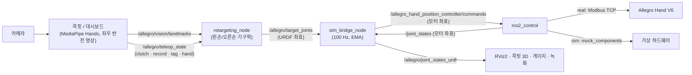

# Allegro Hand Vision Teleoperation (ROS 2 Jazzy, native)

단일 RGB 카메라(웹캠 또는 Intel RealSense)와 MediaPipe Hands로 작업자의 손동작을 추적해 Wonik Robotics **Allegro Hand V6 (5지, 20-DOF)** 를 원격 조종합니다. 왼손/오른손 로봇을 모두 지원하고, VLA 학습용 데이터셋 녹화 기능이 들어 있습니다.

원본 [jacoblee1214/allegro_vision_teleop](https://github.com/jacoblee1214/allegro_vision_teleop)(ROS 2 Humble + `ros_humble_dev` 도커 컨테이너)를 **이 PC 환경(Ubuntu 24.04 + ROS 2 Jazzy, 컨테이너 없음)** 에 맞게 포팅한 저장소입니다. 바뀐 점은 [원본과의 차이](#원본과의-차이)에 정리했습니다.

---

## 목차
1. [환경](#환경)
2. [설치](#설치)
3. [빠른 실행](#빠른-실행)
4. [시스템 구조](#시스템-구조)
5. [왼손/오른손 처리](#왼손오른손-처리)
6. [실행 옵션](#실행-옵션)
7. [단축키](#단축키)
8. [데이터셋 녹화](#데이터셋-녹화)
9. [설정 파일](#설정-파일)
10. [원본과의 차이](#원본과의-차이)
11. [트러블슈팅](#트러블슈팅)

---

## 환경

이 저장소가 전제하는 환경입니다. 값은 모두 `config/teleop.env`에서 바꿀 수 있습니다.

| 항목 | 값 |
|---|---|
| OS / ROS | Ubuntu 24.04 · ROS 2 **Jazzy** (apt 설치, 컨테이너 없음) |
| Python | 시스템 `python3` 3.12 + 이 저장소의 `.venv` |
| 드라이버 패키지 | `~/v6f_manuse_teleoperation` 의 `allegro_hand_v6_bringup` / `_description` / `_hardware` (colcon 빌드된 상태) |
| 로봇 통신 | Modbus TCP `192.168.1.100:502`, PC는 같은 서브넷(`192.168.1.10/24`)의 다른 주소 |
| 유선 인터페이스 | `enp129s0` |
| 카메라 | `/dev/video*` 자동 감지 (RealSense RGB 우선, 없으면 실제로 캡처되는 첫 장치) |
| GPU | NVIDIA dGPU가 보이면 콕핏 3D 뷰만 PRIME 오프로드 |

> 드라이버 패키지가 아직 빌드되지 않았다면 먼저 빌드하세요.
> ```bash
> cd ~/v6f_manuse_teleoperation && colcon build --symlink-install
> ```

---

## 설치

```bash
git clone <this-repo> ~/allegro_vision_teleop_jazzy
cd ~/allegro_vision_teleop_jazzy
./tools/setup.sh              # apt 패키지(sudo) + .venv + meshes 링크 + 검증
```

`tools/setup.sh`가 하는 일:

1. **apt**: `ros-jazzy-ros2-control`, `ros-jazzy-ros2-controllers`, `ros-jazzy-rviz2`, `ros-jazzy-xacro`, `ros-jazzy-robot-state-publisher`, `ros-jazzy-cv-bridge`, `ros-jazzy-rmw-cyclonedds-cpp`, `python3-pyqt5`, `v4l-utils` 등
2. **`.venv`** (`--system-site-packages`): `mediapipe`, `opencv-contrib-python`, `PyOpenGL`, `scipy` 를 pip로 설치. `rclpy` · `cv_bridge` · `PyQt5` 는 apt 것을 그대로 씁니다.
3. **`meshes` 심볼릭 링크**: 드라이버 패키지의 STL 메쉬 → 콕핏 3D 뷰가 워크스페이스를 source 하지 않아도 동작
4. **검증**: 드라이버 패키지 탐색 여부와 모든 파이썬 의존성 import 확인

sudo 없이 돌리려면 `./tools/setup.sh --no-apt` (apt 패키지가 이미 깔려 있을 때).

> **numpy는 1.26.4로 고정입니다.** mediapipe 0.10.x는 numpy 2.x에서 동작하지 않고, pip numpy 2.x를 ROS 2 프로세스에 섞으면 `rclpy` C 확장이 깨집니다. Ubuntu 24.04와 ROS 2 Jazzy가 쓰는 버전이 마침 1.26.4라서 그대로 맞췄습니다.

---

## 빠른 실행

저장소 위치는 자유입니다(원본과 달리 고정 경로가 아닙니다). 어느 디렉토리에서 실행해도 됩니다.

```bash
./check_hand.sh                      # 통신·손 종류·엔코더 확인 (ROS·venv 불필요)
./run_cockpit.sh real                # 콕핏 UI (권장)
./run_dashboard.sh real              # 대시보드 + RViz2
./run_teleop.sh real --cockpit --record   # 콕핏 + 데이터셋 녹화
./run_cockpit.sh sim --hand right    # 로봇 없이 mock 하드웨어로 확인
```

- `real` 모드는 Modbus 레지스터 `0x0071`로 손 종류를 자동 감지합니다. 로그의 `[OK] Hand type auto-detected ...` 줄을 확인하세요. **왼손 로봇을 오른손 모드로 구동하면 손가락이 90° 굽혀집니다.** 감지에 실패하면 `--hand left|right`로 지정합니다.
- `sim` 모드에는 자동 감지가 없으니 `--hand`를 지정하세요.
- 종료는 런처를 실행한 터미널에서 `Ctrl+C`. 런처가 자기가 띄운 모든 노드를 정리합니다.

---

## 시스템 구조


```mermaid
flowchart LR
    CAM["카메라"] --> UI["콕핏 / 대시보드<br/>(MediaPipe Hands, 좌우 반전 영상)"]
    UI -->|"/allegro/vision/landmarks"| RT["retargeting_node<br/>(왼손/오른손 기구학)"]
    UI -->|"/allegro/teleop_state<br/>(clutch · record · tag · hand)"| RT
    RT -->|"/allegro/target_joints<br/>(URDF 좌표)"| BR["sim_bridge_node<br/>(100 Hz, EMA)"]
    BR -->|"/allegro_hand_position_controller/commands<br/>(모터 좌표)"| CM["ros2_control"]
    CM -->|"real: Modbus TCP"| HW["Allegro Hand V6"]
    CM -->|"sim: mock_components"| MOCK["가상 하드웨어"]
    CM -->|"/joint_states (모터 좌표)"| BR
    BR -->|"/allegro/joint_states_urdf"| VIEW["RViz2 · 콕핏 3D · 게이지 · 녹화"]
```

| 파일 | 역할 |
|---|---|
| `run_teleop.sh` | 통합 런처 (환경 source, 카메라·손 종류 감지, 노드 기동, 종료 정리) |
| `run_cockpit.sh`, `run_dashboard.sh` | UI별 런처 |
| `launch/allegro_hand_bringup.launch.py` | ros2_control 브링업 (드라이버 패키지를 건드리지 않음) |
| `config/teleop.env` | 이 PC의 기본값 (워크스페이스·IP·인터페이스·기본 옵션) |
| `teleop_cockpit.py` | 콕핏 UI (카메라 + MediaPipe + OpenGL 3D 뷰) |
| `teleop_dashboard.py` | 대시보드 UI (RViz2와 함께 사용) |
| `retargeting_node.py` | 랜드마크 → 20관절 목표각 (왼손/오른손 별도 파이프라인) |
| `sim_bridge_node.py` | 100 Hz 명령 송출, EMA 필터, URDF ↔ 모터 좌표 변환 |
| `vision_tracker.py` | 헤드리스/단순 GUI 모드의 MediaPipe 노드 |
| `dataset_recorder.py` | 에피소드 녹화 |
| `safety_utils.py` | 관절 순서·한계 정의 |
| `tools/setup.sh` | 설치 스크립트 |
| `tools/check_hand.py`, `check_hand.sh` | 로봇 통신 진단 (표준 라이브러리만 사용) |
| `urdf/` | `allegro_hand_v6_{left,right}.urdf` 사본 (드라이버 패키지와 동일) |

---

## 왼손/오른손 처리

- **손 감지**: `real` 모드에서 Modbus 레지스터 `0x0071`을 읽어 판별하고, 그 값을 리타게팅·브릿지·UI·launch에 똑같이 전달합니다.
- **조종 손**: 로봇 왼손은 작업자 왼손으로, 오른손은 오른손으로 조종합니다. 반대 손을 쓰면 굽힘이 인식되지 않습니다.
- **리타게팅**: 왼손/오른손 파이프라인은 거울 대칭입니다. 굽힘은 같은 값, 벌림은 부호 반대. 엄지는 손별로 따로 튜닝되어 있습니다.
- **URDF 좌표계**: 모든 관절이 0 rad에서 손가락이 곧게 펴지고, 양수가 손바닥 쪽 굽힘입니다.
- **왼손 MCP 모터 오프셋**: 왼손 실물의 MCP 모터(`joint11/21/31/41`)는 펴진 상태에서 −π/2를 읽습니다. 이 변환은 `sim_bridge_node.py` 한 곳에서만 합니다.

| 경로 | 변환 (real + 왼손, joint11/21/31/41) |
|---|---|
| 명령: `/allegro/target_joints` → 컨트롤러 | −π/2 |
| 피드백: `/joint_states` → `/allegro/joint_states_urdf` | +π/2 |

RViz2, 콕핏 3D 뷰, 게이지, 녹화는 모두 `/allegro/joint_states_urdf`를 구독하므로 화면과 데이터는 항상 URDF 좌표계입니다. `sim` 모드와 오른손은 변환 없이 통과합니다.

---

## 실행 옵션

`./run_teleop.sh [nodes|sim|real] [options]` (`run_cockpit.sh`, `run_dashboard.sh`도 같은 옵션)

| 옵션 | 설명 | 기본값 |
|---|---|---|
| `real` / `sim` / `nodes` | 실물 로봇 / mock 하드웨어 / 텔레옵 노드만 | `nodes` |
| `--cockpit`, `--3d` | 콕핏 UI (창 하나, 3D 손 내장) | `config/teleop.env`의 `UI_MODE` (기본 `cockpit`) |
| `--classic`, `--dashboard` | 대시보드 + RViz2 | |
| `--simple-gui` | MediaPipe OpenCV 창만 | |
| `--no-gui`, `--headless` | GUI 없이 실행 | |
| `--rviz` / `--no-rviz` | RViz2 창 강제 on/off | UI에 따라 자동 |
| `--hand left\|right` | 손 종류 지정 (`real`은 자동 감지) | `right` |
| `--ip <주소>` | 로봇 IP (`101` 또는 `192.168.1.101`) | `config/teleop.env`의 `HAND_IP`, 실패 시 후보 탐색 |
| `--descriptor <str>` | io interface descriptor 직접 지정 | `modbus_tcp:$HAND_IP:$HAND_PORT` |
| `--rate`, `--hz <Hz>` | 로봇 명령 송출 주기 | `100` |
| `--alpha <0~1>` | EMA 필터 계수 (작을수록 부드럽고 느림) | `0.25` |
| `--fps <int>` | 카메라 캡처 FPS | `60` |
| `--device <int>` | 카메라 장치 번호 | 자동 감지 |
| `--scale <float>` | `--simple-gui` 창 배율 | `1.75` |
| `--record` | 데이터셋 녹화 노드 실행 | 꺼짐 |

---

## 단축키

UI 창이 활성화된 상태에서 사용합니다.

| 키 | 기능 |
|---|---|
| `C` | 클러치: 추적을 일시정지하고 로봇을 현재 자세로 유지 |
| `R` | 에피소드 녹화 시작/중지 (`--record` 필요) |
| `S` / `F` | 녹화한 에피소드를 성공 / 실패로 태그해 저장 |
| `H` | 손 모델 전환 (`sim`·`nodes` 전용. `real`은 실물이 고정이라 비활성) |
| `Q` / `Esc` | UI 종료 |

- 콕핏 3D 뷰: 좌클릭 드래그 회전, 우클릭 드래그 이동, 휠 확대/축소, 더블클릭으로 기본 시점 복귀.
- 3D 뷰에서 엄지·검지 끝이 노랗게 변하는 것은 핀치 표시입니다. 로봇 제어와는 무관합니다.

---

## 데이터셋 녹화

`--record`로 실행하고 `R`로 녹화, `S`/`F`로 태그합니다.

- 저장 위치: `<저장소>/data/episodes/` (`config/teleop.env`의 `AVT_EPISODE_DIR` 또는 `--output-dir`로 변경)
- 형식: 에피소드별 JSON 파일 + `manifest.json`
- 기록 항목: 관절 목표각(action), 실제 관절 상태(state), MediaPipe 3D 랜드마크, 클러치 상태. state와 action 모두 URDF 좌표계.

`data/`는 `.gitignore`에 들어 있습니다.

---

## 설정 파일

`config/teleop.env`가 이 PC의 기본값을 담고 있고, 런처가 시작할 때 source 합니다. 우선순위는 **명령행 플래그 > 환경변수 > 이 파일**입니다.

| 변수 | 의미 |
|---|---|
| `ALLEGRO_WS` | 드라이버 패키지 colcon 워크스페이스 (`~/v6f_manuse_teleoperation`) |
| `ROS_SETUP` | ROS 2 setup 스크립트 (`/opt/ros/jazzy/setup.bash`) |
| `HAND_IP`, `HAND_PORT`, `HAND_ID` | 로봇 Modbus TCP 주소·포트·슬레이브 id |
| `ETH_IFACE`, `PC_IP` | 로봇과 연결된 유선 인터페이스와 PC 주소 |
| `HAND_SIDE`, `UI_MODE`, `RATE`, `ALPHA`, `FPS`, `SCALE`, `DEVICE` | 텔레옵 기본값 |
| `AVT_EPISODE_DIR` | 녹화 저장 위치 (비우면 `<저장소>/data/episodes`) |

파이썬 노드는 `AVT_URDF_DIR`, `AVT_MESH_DIR`로 URDF·메쉬 경로를 덮어쓸 수 있습니다. 지정하지 않으면 `저장소/urdf` → `저장소/meshes` → 드라이버 패키지 share 순으로 찾습니다.

---

## 원본과의 차이

| 항목 | 원본 (Humble + 도커) | 이 저장소 (Jazzy 네이티브) |
|---|---|---|
| 실행 위치 | 런처가 `ros_humble_dev` 컨테이너로 자동 진입, 경로 `/home/humble_ws/allegro_vision_teleop` 고정 | 컨테이너 없음. 저장소 위치 자유, 스크립트 위치 기준으로 동작 |
| 파일 이름 | `*_v6`, `*_v6_1`, `*_v6_2`, `*_v6_3` 버전 파일 병존 | 최신 버전(`v6_3` 계열)만 남기고 접미사 제거 |
| 드라이버 패치 | `wonik_patch_v6_1/`을 Wonik bringup 패키지에 복사해 재빌드 | 복사 없음. `launch/allegro_hand_bringup.launch.py`가 같은 역할을 저장소 안에서 수행 |
| 파이썬 환경 | 컨테이너에 pip 전역 설치 | `.venv` (`--system-site-packages`), numpy 1.26.4 고정 |
| OpenGL | `LIBGL_ALWAYS_SOFTWARE=1` 전역 + 콕핏만 PRIME | 전역 소프트웨어 렌더링 없음(Mesa 사용 가능). 콕핏만 PRIME 오프로드 |
| rmw | CycloneDDS 강제 | 설치되어 있으면 CycloneDDS, 없으면 기본 rmw로 진행 |
| 하드코딩 경로 | `/home/humble_ws`, `/home/jake/humble_ws` | 전부 `config/teleop.env` + 스크립트 상대 경로 |
| 녹화 경로 | `/home/humble_ws/pinn_hw/results/episodes` | `<저장소>/data/episodes` |
| V4 (4지) 지원 | `run_v4.sh` 포함 | 제외 (이 PC는 V6 5지 하드웨어) |

`launch/allegro_hand_bringup.launch.py`는 `allegro_hand_v6_bringup`의 원본 launch와 비교해 이렇게 다릅니다.

- `rviz` 인자가 실제로 RViz2를 켜고 끕니다 (콕핏은 자체 3D 뷰가 있어서 필요 없음).
- `joint_states_topic`으로 `robot_state_publisher`가 `/allegro/joint_states_urdf`를 읽게 합니다. 왼손 MCP 오프셋 때문에 필요합니다.
- 촉각 릴레이 / 대시보드 / 포즈 GUI 노드는 띄우지 않습니다 (MANUS 데모용).
- 컨트롤러 spawner 타임아웃을 60초로 늘렸습니다. Modbus 하드웨어 초기화가 ~9초 걸려서 기본 10초로는 콜드 스타트 때 `joint_state_broadcaster`가 실패합니다.
- `world → base_link` 정적 변환이 항등입니다. Wonik 브링업은 `pitch = -π/2`를 써서 손가락이 눕고 엄지만 위를 향하는데, `base_link`에서 +Z가 손가락 방향이라 항등 회전이어야 RViz에서 손이 선 자세로 보입니다.

> 이 저장소는 **오른손 전용**으로 운용합니다. 왼손 코드 경로(MCP −π/2 오프셋)는 그대로 남아 있지만 이 PC에서는 쓰지 않습니다.

---

## 트러블슈팅

**통신 확인**: `./check_hand.sh`는 ROS 없이 소켓으로 접속해 통신 상태, 손 종류, 20관절 엔코더 값을 출력합니다. 주소를 직접 주려면 `./check_hand.sh 101`.

**로봇 연결 실패 (RViz2에서 손이 흩어져 보이거나 관절이 안 움직임)**
1. 24 V 전원과 LAN 케이블 확인
2. `ip addr show enp129s0` — PC가 로봇과 같은 서브넷의 **다른** 주소를 가져야 합니다. PC에 `192.168.1.100`을 주면 자기 ping에 자기가 답해서 로봇이 안 보입니다.
3. `ping 192.168.1.100`이 응답하면 런처를 다시 실행

**PC에 `192.168.1.x` 주소가 없을 때**

런처의 `ip addr add`는 root 권한이 필요해서 일반 사용자로 실행하면 조용히 실패합니다. NetworkManager 프로필로 한 번만 만들어 두면 됩니다(sudo 불필요).

```bash
nmcli con add type ethernet ifname enp129s0 con-name allegro-hand \
      ipv4.method manual ipv4.addresses 192.168.1.10/24 ipv6.method ignore
nmcli con up allegro-hand
```

이 PC에는 `allegro-hand` 프로필이 이미 만들어져 있습니다. 케이블을 다시 꽂은 뒤 주소가 없으면 `nmcli con up allegro-hand`만 실행하세요.

**`Package 'allegro_hand_v6_bringup' not found`**
- 드라이버 워크스페이스가 빌드되지 않았습니다. `cd ~/v6f_manuse_teleoperation && colcon build --symlink-install`

**`ModuleNotFoundError: No module named 'mediapipe'`**
- `.venv`가 없거나 런처가 시스템 python으로 폴백한 경우입니다. `./tools/setup.sh`를 한 번 실행하세요. 런처는 `.venv`가 없으면 경고를 찍고 진행합니다.

**카메라가 안 켜짐 / `Device or resource busy`**
- 이전 세션이 정상 종료되지 않아 장치를 잡고 있는 경우입니다. 런처는 시작할 때 남아 있는 텔레옵 UI 프로세스를 정리하지만, 안 되면 `--device <번호>`로 다른 장치를 지정하세요. 이 PC에는 `/dev/video0~3`이 있고 실제 캡처되는 장치는 `video0`입니다.

**`RMW implementation not installed (expected 'rmw_cyclonedds_cpp')`**
- `sudo apt install ros-jazzy-rmw-cyclonedds-cpp` 또는 `RMW_IMPLEMENTATION=` 를 비운 채로 실행하세요. 런처는 CycloneDDS가 없으면 자동으로 기본 rmw를 씁니다.

**콕핏 3D 뷰가 느림**
- NVIDIA dGPU가 안 보이는 경우입니다(`nvidia-smi` 확인). 소프트웨어 렌더링에서 476k 삼각형 STL은 프레임당 ~50 ms입니다.

**왼손 로봇의 손가락이 켜자마자 90° 굽혀짐**
- 오른손 모드로 실행된 경우입니다. 런처 로그의 손 감지 결과를 확인하고 필요하면 `--hand left`로 실행하세요.
